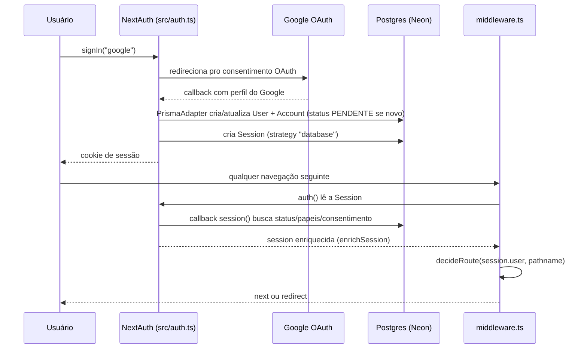
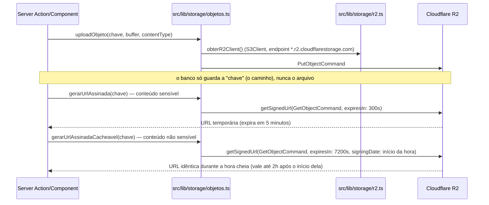
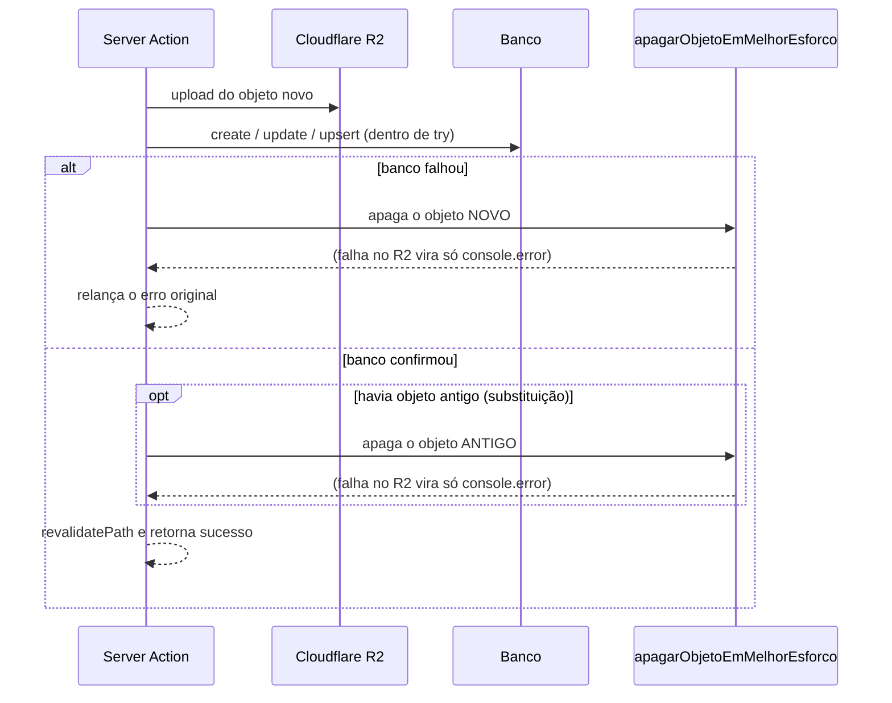

# Arquitetura

> Se você está chegando agora, leia primeiro [`docs/index.md`](./index.md). Este documento cobre como as peças se encaixam; o "o que cada feature faz" está em [`docs/features/`](./features/), e o modelo de dados completo está em [`docs/database.md`](./database.md).

## Visão geral (sem jargão)

O Comunidade Belle et Belle é um site (Next.js) com quatro "áreas" diferentes dependendo de quem está logado: o feed geral (todo mundo), a área da cliente (medidas, desafios, perfil), a área da parceria (nutricionista/personal enviando planos) e o painel de gestão (só administração). Uma única "portaria" (o middleware de autenticação) decide, a cada clique, se a pessoa pode estar onde está tentando ir — se não pode, ela é redirecionada para o lugar certo (login, tela de espera, tela de termo, etc.) sem precisar de nenhuma lógica repetida em cada página.

O banco de dados fica na nuvem (Neon, um Postgres gerenciado), e as fotos/PDFs enviados pelos usuários não ficam no servidor nem no banco — ficam num "depósito" separado (Cloudflare R2), e o site só guarda o endereço de cada arquivo, gerando links temporários e assinados quando precisa mostrar algo.

## Stack

| Camada | Tecnologia | Versão | Onde configurar |
| --- | --- | --- | --- |
| Framework | Next.js (App Router) | `16.3.0` | `next.config.ts` |
| UI | React | `19.2.8` | — |
| ORM | Prisma (`prisma-client` generator) + `@prisma/adapter-pg` | `^7.9.1` | `prisma.config.ts`, `prisma/schema.prisma` |
| Banco | PostgreSQL (Neon, produção) / Postgres 16 via Docker (testes) | — | `DATABASE_URL` |
| Storage de arquivos | Cloudflare R2 (S3-compatible), via `@aws-sdk/client-s3` + `@aws-sdk/s3-request-presigner` | AWS SDK `^3.1106.0` | `src/lib/storage/r2.ts` |
| Autenticação | NextAuth (Auth.js) v5, provider Google, `@auth/prisma-adapter`, sessão em banco | `^5.0.0-beta.32` | `src/auth.ts` |
| Testes | Vitest (unitário) + config separada de integração | `^4.1.10` | `vitest.config.mts`, `vitest.integration.config.mts` |
| Gerenciador de pacotes | npm | — | `package-lock.json` |
| Deploy | Vercel (implícito pelo template padrão do Next.js; sem arquivo de config de outra plataforma no repo) | — | — |

> ⚠️ Este projeto roda em uma versão fork/modificada do Next.js com convenções e APIs que podem divergir do que você conhece — leia `AGENTS.md` na raiz e os guias em `node_modules/next/dist/docs/` antes de mexer em código que dependa de comportamento específico do framework.

## Camadas de acesso (layouts + gates)

```mermaid
flowchart TD
    Root["/ (layout.tsx raiz)<br/>mostra nav só se ATIVO + consentimento"] --> MW[middleware.ts]
    MW -->|sem sessão| Login[/login]
    MW -->|SUSPENSO| Suspensa[/conta-suspensa]
    MW -->|PENDENTE| Aguardando[/aguardando-aprovacao]
    MW -->|ATIVO sem consentimento| BemVinda[/bem-vinda]
    MW -->|liberado| Areas

    subgraph Areas["Áreas protegidas por layout próprio"]
        Feed["/feed<br/>(sem gate de papel, só sessão)"]
        Cliente["/cliente/*<br/>gate: podeAcessarDesafiosCliente<br/>(cliente/layout.tsx)"]
        Parceria["/parceria/*<br/>gate: podeAcessarAreaParceria<br/>(parceria/layout.tsx)"]
        Painel["/painel/*<br/>gate: podeAcessarPainel<br/>(painel/layout.tsx)"]
        Perfil["/perfil/[clienteId]<br/>(sem gate de papel, qualquer sessão)"]
    end
```

Cada layout (`cliente/layout.tsx`, `parceria/layout.tsx`, `painel/layout.tsx`) faz sua própria checagem de papel com `redirect("/")` caso negado — é uma segunda camada de defesa, redundante em relação ao middleware por desenho (o middleware cobre "a conta está numa situação que permite navegar", os layouts cobrem "o papel específico dessa área"). Dentro de cada página/Server Action, gates adicionais (`requererPapel`, `requererAcessoPainel`, `requererSessao`, todos em `src/lib/auth/requerer-acesso-painel.ts`) são a checagem que realmente importa para mutações — nenhuma escrita no banco confia só no layout.

## Fluxo de autenticação e gates



Detalhes completos do fluxo de aprovação/consentimento e da árvore de decisão do gate estão em [`docs/features/identidade-acesso.md`](./features/identidade-acesso.md).

## Padrões-chave do código

### `executarAction` / `AppError`

`src/lib/actions/executar-action.ts` é o wrapper padrão de toda Server Action. Regra: **erros intencionais** (mensagem pensada para aparecer na tela) devem ser lançados como `new AppError("mensagem amigável")`; qualquer outro erro (Prisma, rede, bug) é automaticamente mascarado por uma mensagem genérica ("Não foi possível concluir a ação.") e logado no servidor com `console.error`, para nunca vazar detalhe técnico ao usuário final. Sinais internos de controle de fluxo do Next (`redirect`, `notFound`) são relançados via `unstable_rethrow` antes de qualquer tratamento — isso precisa ser a primeira linha do `catch`, por exigência da própria API do Next.

```ts
export async function minhaAction() {
  return executarAction(async () => {
    // ... lógica ...
    if (condicaoInvalida) throw new AppError("Mensagem que o usuário vai ver");
    // qualquer outro throw aqui vira mensagem genérica automaticamente
  });
}
```

### `useAcaoComErro`

`src/hooks/use-acao-com-erro.ts` é o hook client-side companheiro: envolve uma Server Action em `useTransition`, expõe `isPending`/`erro`/`executar`, e mostra `error.message` diretamente na tela. Isso é seguro porque toda Server Action passa por `executarAction`.

### Gates de acesso

`requererPapel(papeis[])`, `requererAcessoPainel()` (atalho para `["GESTORA", "ADMIN"]`) e `requererSessao()` (`src/lib/auth/requerer-acesso-painel.ts`) são as funções que toda Server Action de escrita deve chamar antes de tocar no banco. Todas lançam `AppError("Acesso negado")` em caso de negação — nunca retornam um booleano silencioso.

### Padrão "um ativo por vez"

Repetido em três lugares do domínio — `Desafio.ativo`, `CicloPacote.ativo` e `Post.destaque` — e sempre implementado da mesma forma: **não há constraint de banco** impedindo dois registros ativos simultâneos; a exclusividade é garantida **na aplicação**, dentro de uma `prisma.$transaction([...])` que primeiro desliga o registro atualmente ativo (`updateMany`) e só então liga o novo. Antes de criar um quarto caso desse padrão em qualquer feature nova, replique exatamente essa forma (transação com `updateMany` + `create`/`update`), não um `unique` parcial no schema — o projeto já decidiu não ir por esse caminho.

| Onde | Escopo da exclusividade | Doc da feature |
| --- | --- | --- |
| `Desafio.ativo` | Global (só 1 desafio ativo no sistema todo) | [`docs/features/desafios.md`](./features/desafios.md) |
| `CicloPacote.ativo` | Por cliente (`clienteId`) | [`docs/features/pacotes.md`](./features/pacotes.md) |
| `Post.destaque` | Global | [`docs/features/feed.md`](./features/feed.md) |

## Storage (R2)



Cada feature que lida com arquivos tem seu próprio módulo fino em `src/lib/storage/` (ex.: `fotos.ts`, `perfil.ts`, `planos.ts`, `posts.ts`, `comprovantes-*.ts`, `jornada-desafio.ts`) — todos delegam para as funções genéricas de `objetos.ts` (`uploadObjeto`, `gerarUrlAssinada`, `gerarUrlAssinadaCacheavel`, `deletarObjeto`, `apagarObjetoEmMelhorEsforco`; ver [Dois tipos de URL assinada](#dois-tipos-de-url-assinada-efêmera-vs-cacheável) e [Consistência entre banco e R2](#consistência-entre-banco-e-r2-o-banco-é-a-fonte-da-verdade)), e cada um decide suas próprias regras de validação (tipo de arquivo, tamanho máximo, compressão). A validação real de formato é feita lendo os bytes do arquivo (magic bytes, via `sharp`), não confiando no `Content-Type` declarado pelo client — decisão de segurança documentada no próprio código de `comprimir-imagem.ts`. Para o PDF de plano, o equivalente é `uploadPlano` (`planos.ts`), que exige a assinatura `%PDF-` nos primeiros bytes além do tipo declarado e do limite de 5MB (ver [`docs/features/parcerias.md`](./features/parcerias.md#validação-do-pdf)).

Exclusão de arquivo é sempre real (`DeleteObjectCommand`), nunca uma flag de "apagado" no banco — condizente com a promessa de exclusão de dados feita no termo de consentimento (ver [`docs/features/identidade-acesso.md`](./features/identidade-acesso.md)).

### Dois tipos de URL assinada: efêmera vs. cacheável

**Em linguagem simples:** o navegador nunca recebe o "endereço permanente" de um arquivo do R2; recebe um link com prazo de validade. Para fotos do corpo e comprovantes, o link vence em 5 minutos e muda a cada vez que a página é montada. Para imagens que não são sensíveis (foto de perfil, foto que a pessoa enviou num post), o app usa um link "da hora": durante a mesma hora cheia, a mesma imagem recebe exatamente o mesmo link. Como o link não muda, o navegador e o otimizador de imagens do Next conseguem reaproveitar a cópia que já baixaram, em vez de baixar de novo a cada carregamento do feed.

**Detalhe técnico** (`src/lib/storage/objetos.ts`):

| Função | Validade | Como a URL é gerada | Para quê |
| --- | --- | --- | --- |
| `gerarUrlAssinada(chave)` | 300s (`EXPIRACAO_URL_ASSINADA_SEGUNDOS`) | `getSignedUrl` com o relógio atual: cada chamada produz uma URL diferente | Conteúdo sensível: fotos de evolução, imagem de post com `fotoEvolucaoId`, fotos de jornada (antes/depois), comprovantes de desafio, PDF de plano |
| `gerarUrlAssinadaCacheavel(chave, agora?)` | 7200s (`EXPIRACAO_URL_CACHEAVEL_SEGUNDOS`) | `signingDate` arredondado para baixo ao início da janela de 1h (`JANELA_URL_CACHEAVEL_MS`): toda chamada dentro da mesma hora gera a **mesma** URL; na virada da hora, a URL muda | Conteúdo não sensível: foto de perfil (cliente e parceria) e imagem de post enviada por upload próprio |

Como a assinatura parte do início da hora e vale 2h, uma URL gerada no último segundo da janela (ex.: 10:59:59) ainda vale até 12:00 — sempre resta pelo menos 1h de validade. O parâmetro `agora` existe para os testes (`src/lib/storage/objetos.test.ts`) fixarem o relógio.

`perfil.ts` e `parcerias.ts` reexportam as duas funções; os demais módulos de storage (`fotos.ts`, `posts.ts`, `planos.ts`, `comprovantes-*.ts`, `jornada-desafio.ts`) reexportam só `gerarUrlAssinada`. Quem chama a versão cacheável hoje:

| Arquivo | Imagem |
| --- | --- |
| `src/app/feed/queries.ts` | Avatar da autora (`gerarUrlAssinadaPerfil`) e imagem do post **quando `fotoEvolucaoId` é nulo** (com `fotoEvolucaoId`, usa `gerarUrlAssinada`) |
| `src/app/perfil/[clienteId]/queries.ts` | Avatar do perfil público e imagem de post com a mesma regra do feed (as fotos de evolução públicas continuam com `gerarUrlAssinada`) |
| `src/app/cliente/perfil/page.tsx` | Foto do próprio perfil da cliente |
| `src/app/parceria/perfil/page.tsx` | Foto do próprio perfil da parceria |
| `src/app/cliente/parcerias/queries.ts` | Foto do `PerfilParceria` das parcerias vinculadas |
| `src/app/cliente/desafios/queries.ts` | Avatar de cada linha do ranking (as fotos de jornada continuam com `gerarUrlAssinada`) |

**Regra para código novo:** a escolha acompanha a de `ImagemSensivel` (abaixo). Imagem que seria renderizada com `ImagemSensivel` usa `gerarUrlAssinada`; imagem não sensível pode usar `gerarUrlAssinadaCacheavel`. Em telas que misturam os dois casos (feed, perfil público), a decisão é feita por item, olhando `post.fotoEvolucaoId`.

### Cotas de upload por usuária (`src/lib/storage/cotas.ts`)

**Em linguagem simples:** além do limite de tamanho de cada arquivo, cada pessoa tem um "teto" de quantos arquivos pode enviar em três lugares do app. É como a franquia de um plano de celular: passou do limite, o app avisa e não aceita mais até a franquia "renovar" (ou, no caso das fotos de evolução, até a cliente liberar espaço excluindo fotos antigas).

**Detalhe técnico:** `cotas.ts` exporta uma função `garantirCota*` por caso. Cada uma faz um `prisma.<model>.count(...)` e, se o total já tiver chegado ao limite, lança `AppError` com uma mensagem amigável — que chega à tela pelo caminho normal de `executarAction` (ver `CLAUDE.md`, "Padrões-chave"). As actions chamam a função **antes** do upload ao R2, então um envio barrado pela cota não grava nada no bucket. As janelas de 24h são móveis (`agora - JANELA_COTA_MS`), não por dia do calendário, e a contagem olha o que existe no banco: apagar um registro libera a vaga.

| Função | Limite (constante) | O que conta | Chamada em | Doc |
| --- | --- | --- | --- | --- |
| `garantirCotaFotosEvolucao(clienteId)` | 100 fotos no total (`LIMITE_FOTOS_EVOLUCAO_POR_CLIENTE`), sem janela | Todas as `FotoEvolucao` da cliente | `enviarFoto` (`src/app/cliente/fotos/actions.ts`) | [`perfil.md`](./features/perfil.md#limite-de-fotos-de-evolução) |
| `garantirCotaPostsComImagem(autorId, agora?)` | 10 em 24h (`LIMITE_POSTS_COM_IMAGEM_POR_JANELA`) | `Post` da autora com `imagemChave` preenchida e `fotoEvolucaoId` nulo, `criadoEm` na janela | `criarPost` (`src/app/feed/actions.ts`), só quando vem arquivo novo | [`feed.md`](./features/feed.md#cota-de-posts-com-imagem) |
| `garantirCotaPlanos(parceriaId, agora?)` | 5 em 24h (`LIMITE_PLANOS_POR_JANELA`) | `PlanoRecebido` enviados pela parceria, `enviadoEm` na janela | `enviarPlano` (`src/app/parceria/planos/actions.ts`) | [`parcerias.md`](./features/parcerias.md#cota-de-envio-de-planos) |

```mermaid
sequenceDiagram
    participant A as Server Action (enviarFoto / criarPost / enviarPlano)
    participant C as src/lib/storage/cotas.ts
    participant DB as Banco
    participant S as Módulo de storage (fotos.ts / posts.ts / planos.ts)
    participant R2 as Cloudflare R2

    A->>C: garantirCota*(id do usuário)
    C->>DB: count(...) na janela / no total
    alt limite atingido
        C-->>A: throw AppError (mensagem do limite)
        Note over A: executarAction devolve a mensagem ao client; nada vai ao R2
    else dentro do limite
        A->>S: upload*(arquivo)
        S->>R2: PutObjectCommand
        A->>DB: create do registro
    end
```

Fora das cotas ficam: `editarPost` (a troca de imagem apaga do R2 a imagem antiga do post, então o total de objetos não cresce), foto de perfil (cliente e parceria, sempre substitui a anterior) e os uploads de desafios (comprovantes e jornada). O parâmetro opcional `agora` das funções com janela existe para os testes (`cotas.test.ts`, `cotas.integration.test.ts`) fixarem o relógio. Ao criar um novo caminho de upload que acumule arquivos por usuária, avalie adicionar uma função aqui seguindo o mesmo formato (contar, comparar com a constante, lançar `AppError` antes do upload).

### Consistência entre banco e R2: o banco é a fonte da verdade

**Em linguagem simples:** cada arquivo vive em dois lugares ao mesmo tempo — o arquivo em si fica no R2 e o "endereço" dele (a `chave`) fica numa linha do banco. Como são dois sistemas separados, não dá para gravar os dois "de uma vez só": um pode dar certo e o outro falhar. O app segue uma regra simples para esses casos: **o que vale é o banco**. Se for preciso escolher entre um arquivo sobrando no R2 sem ninguém apontar para ele (um "órfão", que só ocupa espaço e fica registrado no log) e uma linha do banco apontando para um arquivo que não existe (uma imagem quebrada na tela da cliente), o app sempre escolhe o órfão. É como trocar o quadro de uma parede: primeiro pendura o novo, confirma que ficou firme, e só então joga o velho fora; se o novo cair, o velho continua lá.

**Detalhe técnico** — o helper `apagarObjetoEmMelhorEsforco(chave, contexto)` (`src/lib/storage/objetos.ts`) chama `deletarObjeto` dentro de um `try/catch`: se o R2 falhar, faz `console.error("Falha ao apagar objeto no R2 (<contexto>):", chave, erro)` e **não relança**. O `contexto` é uma string livre que identifica a action e o motivo (ex.: `"enviarFoto: falha ao gravar no banco"`, `"atualizarPerfil: foto substituída"`), para o log dizer de onde veio o órfão. Toda remoção de objeto feita pelas actions abaixo passa por esse helper — as funções `deletar*` específicas dos módulos de storage (`deletarFoto`, `deletarFotoPerfil`, etc.) não são mais chamadas por essas actions.

As actions seguem três formatos:

| Formato | Ordem | Se o banco falhar | Se o R2 falhar ao apagar | Actions |
| --- | --- | --- | --- | --- |
| **Upload novo com compensação** | Sobe o objeto → grava no banco (dentro de `try`) | `catch` apaga o objeto recém-enviado (helper) e **relança o erro original** (o client recebe a mensagem de `executarAction`) | Só log; o erro do banco continua sendo o que sobe | `enviarFoto` (`cliente/fotos`), `criarPost` (`feed`, só com upload próprio), `enviarPlano` (`parceria/planos`), `marcarItemComFoto` e `participarDesafioSurpresa` (`cliente/desafios`, esta só quando há `fotoChave`), `enviarFotoJornada` (`cliente/desafios`, função interna de `enviarFotoAntes`/`enviarFotoDepois`) |
| **Substituição** | Sobe o novo → `update`/`upsert` no banco → só então apaga o antigo (helper) | Apaga o **novo** (helper) e relança; o antigo continua referenciado e intacto | Antigo vira órfão logado; a ação conclui com sucesso | `atualizarPerfil` (`cliente/perfil`), `atualizarPerfilParceria` (`parceria/perfil`), `enviarFotoJornada` (quando já existia foto antes/depois), `editarPost` (`feed`) |
| **Exclusão** | Apaga do banco → depois apaga do R2 (helper) | Nada foi tocado no R2 | Órfão logado; a ação conclui com sucesso | `excluirFoto` (`cliente/fotos`), `apagarPost` (`feed`), `deletarMembro` (`painel/membros`), `aprovarMarcacaoItem`/`rejeitarMarcacaoItem` (`painel/aprovacoes`), `aprovarParticipacao`/`rejeitarParticipacao`, `removerCategoria`, `removerItem` e `removerDesafioSurpresa` (`painel/desafios/[desafioId]`) |



Casos particulares que vale conhecer:

- **Chave de foto de evolução nunca é apagada por action de post.** Em `criarPost`, a compensação só roda quando a imagem veio de upload próprio (flag local `uploadProprio`); se o post reaproveitou uma `FotoEvolucao`, a `imagemChave` pertence à foto e fica intacta. Em `editarPost` e `apagarPost`, a imagem antiga só é apagada quando `post.fotoEvolucaoId` é nulo.
- **Validações antes do upload.** `editarPost` confere "texto ou imagem" **antes** de subir o arquivo novo; `criarPost` faz essa checagem dentro do `try`, então um post recusado por estar vazio depois de um upload também dispara a compensação.
- **`atualizarPerfil`/`atualizarPerfilParceria`** leem o perfil atual (para saber a chave antiga) dentro do mesmo `try` do `upsert`: qualquer falha de banco nessa etapa apaga a foto nova. O `update` de `User.name` em `atualizarPerfil` roda depois e fora desse `try`.
- **`deletarMembro`** primeiro chama `listarChavesDoUsuario(userId)` — que junta, num `Set` (sem duplicatas), as chaves de `Perfil`, `PerfilParceria`, `FotoEvolucao`, `JornadaDesafio` (antes e depois), `ParticipacaoSurpresa`, `MarcacaoItem` (com `fotoChave` não nula), `Post` e `PlanoRecebido` — porque o `onDelete: Cascade` do `user.delete` apaga essas linhas. Só depois do `user.delete` confirmado é que as chaves são apagadas em paralelo (`Promise.all`) pelo helper. A deduplicação evita apagar duas vezes a mesma chave (ex.: um post que reaproveita uma foto de evolução tem a mesma `imagemChave` da foto).

- **Aprovação de comprovante "esvazia" a chave.** `aprovarMarcacaoItem` e `aprovarParticipacao` gravam `validado: true` **e** `fotoChave: null` no mesmo `update`, e só depois apagam o objeto — o registro aprovado nunca fica apontando para uma foto que já saiu do bucket. As rejeições apagam o registro inteiro e depois a foto.
- **Remoções em cascata da gestora.** `removerCategoria`, `removerItem` e `removerDesafioSurpresa` seguem o mesmo raciocínio de `deletarMembro`: um `findMany` com `fotoChave: { not: null }` lista os comprovantes que o cascade vai levar, o `delete` roda, e só então `apagarComprovantes` (helper interno de `src/app/painel/desafios/[desafioId]/actions.ts`) apaga os objetos em paralelo com `apagarObjetoEmMelhorEsforco`.

**Regra para código novo:** todo caminho que suba um objeto ao R2 e grave a chave no banco deve seguir um desses três formatos — compensar o upload se o banco falhar, apagar o objeto antigo só depois do banco confirmar a troca, e apagar do R2 só depois de apagar do banco — sempre usando `apagarObjetoEmMelhorEsforco` com um `contexto` descritivo.

### Exibindo imagens sensíveis: `ImagemSensivel`

**Em linguagem simples:** a foto de uma cliente só pode ser vista por quem recebeu o "link temporário" dela, e esse link vence em poucos minutos. Para que esse prazo valha de verdade, fotos do corpo e comprovantes são entregues ao navegador **direto do R2**, sem passar pela "copiadora" de imagens do Next (o otimizador `/_next/image`, que redimensiona e guarda cópias por horas).

**Detalhe técnico:** `src/components/imagem-sensivel.tsx` é um wrapper fino de `next/image` que sempre passa `unoptimized` — a prop vem **depois** do spread de props, então quem usa o componente não consegue sobrescrevê-la. Com isso, o `` renderizado aponta para a signed URL do R2 (expira em 300s) em vez de `/_next/image?url=...`.

| Onde é usado | Imagem |
| --- | --- |
| `src/app/cliente/fotos/item-foto.tsx` | Fotos de evolução da própria cliente |
| `src/app/perfil/[clienteId]/page.tsx` | Galeria de fotos de evolução públicas e imagem de post com `fotoEvolucaoId` |
| `src/app/feed/cartao-post.tsx` | Imagem do post **só quando** `post.fotoEvolucaoId` está preenchido (upload comum do post continua com `next/image` otimizado) |
| `src/app/feed/novo/formulario-novo-post.tsx` | Miniaturas do seletor de foto de evolução |
| `src/app/cliente/desafios/fotos-jornada.tsx` | Fotos de "antes" e "depois" da jornada do desafio |
| `src/app/painel/aprovacoes/page.tsx` | Fotos de comprovação de item e de desafio surpresa |
| `src/app/painel/desafios/[desafioId]/page.tsx` | Fotos de comprovação de desafio surpresa |

**Regra para código novo:** qualquer tela que exiba foto corporal, foto de evolução ou comprovante (imagem vinda de `src/lib/storage/fotos.ts`, `jornada-desafio.ts` ou `comprovantes-*.ts`) deve usar `ImagemSensivel`, não `next/image` direto. Imagens não sensíveis (foto de perfil, upload próprio de post, emblemas) continuam com `next/image` normal, e as que vêm do R2 usam a URL cacheável (ver [Dois tipos de URL assinada](#dois-tipos-de-url-assinada-efêmera-vs-cacheável)). Observação: em dev, `next.config.ts` já desliga a otimização para todas as imagens (`images.unoptimized` fora de produção, por causa do problema do `sharp` no WSL2), então a diferença entre os dois componentes só aparece em build de produção.

## Configuração por ambiente

| Arquivo | Quando é lido | Propósito |
| --- | --- | --- |
| `.env` | `next build` / `next start` (produção) e por padrão em qualquer ambiente que não sobrescreva | `DATABASE_URL`, `AUTH_SECRET`, `AUTH_GOOGLE_ID`, `AUTH_GOOGLE_SECRET`, `R2_ACCOUNT_ID`, `R2_ACCESS_KEY_ID`, `R2_SECRET_ACCESS_KEY`, `R2_BUCKET_NAME` — credenciais do ambiente onde o processo roda |
| `.env.local` | `next dev` **e** `next start`, tem prioridade sobre `.env` em ambos | Hoje só sobrescreve `DATABASE_URL` — é o mecanismo pra apontar o `next dev` local para um banco de desenvolvimento, **evitando que o dev local escreva no Neon de produção** |
| `.env.test` | Carregado manualmente por `scripts/migrate-test-db.mjs` (via `dotenv`) antes de `prisma migrate deploy`, e pelos testes de integração (`vitest.integration.setup.ts`) | `DATABASE_URL` apontando para o Postgres local do `docker-compose.test.yml` (porta `5435`) |
| `.env.test.example` | Nunca carregado — é só um exemplo versionado | Mostra o formato esperado de `.env.test` para quem configura o projeto pela primeira vez |

**Isso já causou confusão real neste projeto**: o Next.js tem uma ordem de precedência de arquivos de env diferente entre `next dev` e `next build`/`next start` (`.env.production.local` só vale para build/start; `next dev` usa `.env.development.local` ou `.env.local`). Um incidente documentado na skill de load-testing (`.claude/skills/load-testing-nextjs/SKILL.md`, seção "Armadilhas") registra que rodar `next dev` localmente acabou apontando para o `DATABASE_URL` de **produção** do `.env`, porque o override só existia em `.env.production.local`. **Sempre confira a linha `- Environments: ...` que o Next imprime no boot** antes de rodar qualquer coisa que escreva no banco.

Detalhe de uso de cada variável de storage (todas em `.env`, lidas via `process.env` onde quer que ele resolva, incluindo variáveis de ambiente da plataforma de deploy em produção):

| Variável | Uso |
| --- | --- |
| `R2_ACCOUNT_ID` | Monta o endpoint `https://<accountId>.r2.cloudflarestorage.com` |
| `R2_ACCESS_KEY_ID` / `R2_SECRET_ACCESS_KEY` | Credenciais do client S3 apontando pro R2 |
| `R2_BUCKET_NAME` | Nome do bucket; também usado em `next.config.ts` para montar o `remotePatterns` de `next/image` |

## CI

`.github/workflows/ci.yml` roda em todo push para `main` e em pull requests: sobe um Postgres 16 de serviço, `npm ci`, `prisma generate`, `prisma migrate deploy`, lint, typecheck, `vitest run` (unitário), `vitest run --config vitest.integration.config.mts` (integração) e por fim `next build`. Não há step de deploy nesse workflow — o deploy é presumivelmente feito pela integração nativa da Vercel com o repositório Git (não há configuração de outra pipeline de deploy no repo).

## Agentes e skills do Claude Code (`.claude/`)

O `.gitignore` ignora o conteúdo de `.claude/` por padrão, com duas exceções explícitas que **são** versionadas: `.claude/agents/` e `.claude/skills/`.

- **`.claude/agents/`** (versionado): `doc-sync-onboarding.md` (mantém esta documentação sincronizada com o código) e `load-test-runner-nextjs.md` (executa a skill de teste de carga abaixo).
- **`.claude/skills/`** (versionado, com duas exceções): `speckit-*` (fluxo de spec-kit usado em `specs/`), `cyclomatic-complexity` e `load-testing-nextjs`. As exceções, re-ignoradas por regras específicas do `.gitignore`: `.claude/skills/prisma-*` são symlinks locais para `.agents/` (pasta ignorada, gerada pelo `prisma init` em cada máquina) e `.claude/skills/load-testing-geral/` (equivalente da skill de load test para projetos Django, não usada neste projeto Next.js) não é versionada.
