# Banco de dados

> Documento técnico. Se você está chegando agora, leia primeiro [`docs/index.md`](./index.md) e [`docs/architecture.md`](./architecture.md) para ter o quadro geral antes de mergulhar nos campos de cada tabela.

## Visão geral (sem jargão)

Pense no banco como um arquivo físico de uma clínica de estética/personal, só que digital. Existe uma ficha por pessoa (`User`), e cada "gaveta" da ficha guarda um tipo de informação: quem ela é e que papel exerce (cliente, parceria, gestora), suas medidas ao longo do tempo, os desafios que participou, os pacotes de sessão que contratou, o que ela postou no feed, e os planos de treino/dieta que recebeu de uma parceria.

Duas ideias se repetem em várias tabelas e valem a pena internalizar antes de ler o resto:

1. **"Só um ativo por vez"**: em vários lugares (o desafio corrente, o ciclo de pacote em vigor de uma cliente, o post fixado no feed), o sistema não *apaga* o registro anterior quando um novo é criado — ele marca o antigo como `ativo = false` (ou `destaque = false`) e o novo como ativo. Histórico nunca é perdido, só "desligado".
2. **Storage é só a chave, o arquivo mora no R2**: campos como `fotoChave`, `imagemChave`, `arquivoChave` não guardam o arquivo, guardam o *caminho* dele no bucket do Cloudflare R2. Ver [`docs/architecture.md`](./architecture.md#storage-r2) para como a URL é gerada a partir dessa chave.

Banco: **PostgreSQL** hospedado na **Neon**, acessado via **Prisma ORM `^7.9.1`** com o driver adapter `@prisma/adapter-pg` (`src/lib/prisma.ts`). Todo `id` é uma `String` `cuid()`.

## Diagrama de entidades

```mermaid
erDiagram
    User ||--o| Perfil : "tem"
    User ||--o| PerfilParceria : "tem (se PARCERIA)"
    User ||--o| Consentimento : "aceitou termo"
    User ||--o{ UsuarioPapel : "tem papéis"
    User ||--o{ RegistroMedida : "registra"
    User ||--o{ FotoEvolucao : "envia"
    User ||--o{ VinculoParceria : "como cliente"
    User ||--o{ VinculoParceria : "como parceria"
    User ||--o{ PlanoRecebido : "recebe (cliente)"
    User ||--o{ PlanoRecebido : "envia (parceria)"
    User ||--o{ MarcacaoItem : "marca"
    User ||--o{ ParticipacaoSurpresa : "participa"
    User ||--o{ Conquista : "conquista"
    User ||--o{ JornadaDesafio : "registra jornada"
    User ||--o{ Post : "publica"
    User ||--o{ Like : "curte"
    User ||--o{ Comentario : "comenta"
    User ||--o{ CicloPacote : "contrata"
    User ||--o{ SessaoRealizada : "marca (gestora)"
    User ||--o{ Account : "conta OAuth"
    User ||--o{ Session : "sessão ativa"

    Desafio ||--o{ CategoriaDesafio : "tem"
    Desafio ||--o{ RegraBonus : "tem"
    Desafio ||--o{ DesafioSurpresa : "tem"
    Desafio ||--o{ Conquista : "gera"
    Desafio ||--o{ JornadaDesafio : "tem"
    Desafio }o--o| Emblema : "premia ranking semanal"
    Desafio }o--o| Emblema : "premia ranking geral"

    CategoriaDesafio ||--o{ ItemDesafio : "tem"
    ItemDesafio ||--o{ MarcacaoItem : "é marcado em"
    ItemDesafio }o--o{ RegraBonus : "compõe combo"

    RegraBonus }o--o| Emblema : "premia com"
    DesafioSurpresa ||--o{ ParticipacaoSurpresa : "recebe"
    Conquista }o--|| Emblema : "referencia"

    TipoPacote ||--o{ ItemTipoPacote : "catálogo"
    TipoSessao ||--o{ ItemTipoPacote : "referenciado em"
    TipoPacote ||--o{ CicloPacote : "modelo de"
    CicloPacote ||--o{ ItemCicloPacote : "itens contratados"
    TipoSessao ||--o{ ItemCicloPacote : "referenciado em"
    CicloPacote ||--o{ SessaoRealizada : "sessões consumidas"
    TipoSessao ||--o{ SessaoRealizada : "referenciado em"

    Post }o--o| FotoEvolucao : "pode anexar"
    Post ||--o{ Like : "recebe"
    Post ||--o{ Comentario : "recebe"

    User {
        string id PK
        string email UK
        StatusConta status
        datetime aprovadoEm
    }
    RegistroMedida {
        string id PK
        string clienteId FK
        decimal peso
        decimal cintura
        date data
    }
    CicloPacote {
        string id PK
        string clienteId FK
        string tipoPacoteId FK
        boolean ativo
        datetime arquivadoEm
    }
    Post {
        string id PK
        string autorId FK
        boolean destaque
    }
```

> O diagrama acima simplifica cardinalidades de leitura (todas as `User ||--o{ X` são "um usuário tem zero ou muitos X"); os detalhes exatos de cada FK — obrigatória/opcional, `onDelete` — estão nas tabelas por bounded context abaixo.

## Enums

| Enum | Valores | Onde é usado |
| --- | --- | --- |
| `Papel` | `ADMIN`, `GESTORA`, `PARCERIA`, `CLIENTE` | `UsuarioPapel.papel` — um usuário pode ter mais de um papel (é uma tabela N:N via `UsuarioPapel`, não um campo único em `User`) |
| `StatusConta` | `PENDENTE`, `ATIVO`, `SUSPENSO` | `User.status` — controla o [gate de acesso](./architecture.md#fluxo-de-autenticação-e-gates) |
| `TipoPlano` | `TREINO`, `DIETA` | `PlanoRecebido.tipo` |
| `FrequenciaItem` | `DIARIO`, `SEMANAL` | `ItemDesafio.frequencia` |
| `TipoBonus` | `LIMIAR_DIARIO`, `COMBO`, `CATEGORIA_COMPLETA` | `RegraBonus.tipo` |
| `TipoConquista` | `RANKING_SEMANAL`, `RANKING_GERAL`, `BONUS` | `Conquista.tipo` |

## Tabelas por bounded context

O comentário no topo do `prisma/schema.prisma` agrupa os models em "contextos" que não são exatamente iguais aos bounded contexts de `docs/features/` (o schema, por exemplo, agrupa `RegistroMedida`, `VinculoParceria` e `PlanoRecebido` todos sob um comentário "Perfil"). Aqui a divisão segue a mesma organização de `docs/features/<nome>.md`, que é a que importa para navegar o código.

### Identidade & acesso — ver [`docs/features/identidade-acesso.md`](./features/identidade-acesso.md)

| Model | Campos-chave | Observações |
| --- | --- | --- |
| `User` | `email` (único), `status`, `aprovadoPor`/`aprovadoEm` | `aprovadoPor` é uma **`String` solta, não uma relação** — guarda o id de quem aprovou, mas sem FK. Ver pegadinha abaixo. |
| `UsuarioPapel` | `userId`, `papel` | `@@unique([userId, papel])` — um usuário não pode ter o mesmo papel duas vezes, mas pode ter vários papéis diferentes (ex.: `GESTORA` + `CLIENTE`). |
| `Consentimento` | `userId` (único), `versaoTermo`, `aceitoEm` | 1:1 com `User`. Existência da linha = aceite do termo (`enrichSession` usa `consentimento !== null`). |
| `Account`, `Session`, `VerificationToken` | — | Tabelas exigidas pelo Auth.js v5 (`@auth/prisma-adapter`), não modeladas pelo domínio. `Session` usa estratégia `"database"` (não JWT). |

### Perfil — ver [`docs/features/perfil.md`](./features/perfil.md)

| Model | Campos-chave | Observações |
| --- | --- | --- |
| `Perfil` | `userId` (único), `bio`, `fotoChave`, `bioPublica`, `emblemasPublicos` (default `true`), `medidasPublicas` (default `false`) | Três toggles de visibilidade **independentes** — cada um liga/desliga uma parte do perfil público. |
| `FotoEvolucao` | `clienteId`, `chave`, `publica`, `data` | Visibilidade **por foto**, separada dos toggles de `Perfil`. Pode ser anexada a um `Post` (`Post.fotoEvolucaoId`) **somente se `publica = true`** (regra de aplicação em `criarPost`); tornar a foto privada ou excluí-la apaga os posts que a usam. |

### Medidas — ver [`docs/features/medidas.md`](./features/medidas.md)

| Model | Campos-chave | Observações |
| --- | --- | --- |
| `RegistroMedida` | `clienteId`, `data`, `peso`, `altura` + ~16 campos de circunferência | Tronco (`ombro`, `peitoBusto`, `cintura`, `abdomen`, `quadril`) sem lado; membros (`bracoDireito`/`bracoEsquerdo`, `antebraco*`, `punho*`, `coxa*`, `joelho*`, `panturrilha*`, `tornozelo*`) bilaterais. Campos legados `braco`/`coxa` (sem lado) preservados só para registros anteriores à bilateralização. Todos `Decimal(5,2)` e opcionais — um registro pode preencher só parte dos campos. |

### Parcerias — ver [`docs/features/parcerias.md`](./features/parcerias.md)

| Model | Campos-chave | Observações |
| --- | --- | --- |
| `VinculoParceria` | `clienteId`, `parceriaId`, `ativo`, `criadoPorId` | `@@unique([clienteId, parceriaId])` — só pode existir um vínculo entre um par cliente/parceria (reativar religa o mesmo registro, não cria outro). `criadoPorId` é **`String` solta, sem FK** (mesma observação de `aprovadoPor`). |
| `PlanoRecebido` | `clienteId`, `parceriaId`, `tipo`, `arquivoChave`, `enviadoEm` | Um envio = uma linha; não há edição, só novos envios. |
| `PerfilParceria` | `usuarioId` (único), `especialidade`, `bio`, `fotoChave` | Perfil próprio da parceria, separado de `Perfil` (que é do cliente). |

### Desafios — ver [`docs/features/desafios.md`](./features/desafios.md)

| Model | Campos-chave | Observações |
| --- | --- | --- |
| `Desafio` | `dataInicio`/`dataFim` (`@db.Date`), `ativo`, `emblemaRankingSemanalId`/`emblemaRankingGeralId` | Padrão "um ativo por vez": ver [`docs/features/desafios.md`](./features/desafios.md) para como o código garante isso (não há `@@unique` no banco forçando só 1 `ativo=true` — é regra de aplicação). |
| `CategoriaDesafio` → `ItemDesafio` | `cor`, `pontos`, `frequencia`, `exigeFoto` | Hierarquia Desafio → Categoria → Item. Mudar `exigeFoto` depois **não é retroativo** — não recalcula o `validado` de `MarcacaoItem` já existentes (`specs/002-comprovacao-foto-desafio/data-model.md`). |
| `MarcacaoItem` | `itemId`, `clienteId`, `data` (`@db.Date`), `fotoChave`, `validado` (default `true`), `validadoPor`, `validadoEm` | `@@unique([itemId, clienteId, data])` — só uma marcação por item/cliente/dia. `validado` **default `true`**: a aprovação manual (`validadoPor`/`validadoEm`) só é relevante quando `exigeFoto = true` no item — ver feature doc. |
| `RegraBonus` | `tipo`, `pontosExtras`, `limiarItens`, `itensCombo`, `emblemaId` | "Tabela guarda-chuva": os três `TipoBonus` compartilham a mesma tabela, cada um usando só o subconjunto de campos que faz sentido (`limiarItens` só para `LIMIAR_DIARIO`, `itensCombo` só para `COMBO`, `categoriaId` só para `CATEGORIA_COMPLETA`) — sem `CHECK` de banco garantindo a exclusividade, só a Server Action de criação. |
| `DesafioSurpresa` → `ParticipacaoSurpresa` | `exigeComprovacao`, `fotoChave`, `validado` (default **`false`**, diferente de `MarcacaoItem`) | `@@unique([desafioSurpresaId, clienteId])` — uma participação por cliente por desafio surpresa. |
| `Emblema` | `nome`, `icone` | Catálogo compartilhado entre `RegraBonus`, `Conquista` e o ranking do `Desafio`. |
| `Conquista` | `clienteId`, `desafioId`, `emblemaId`, `tipo`, `referencia` | Registro de "cliente X ganhou emblema Y no desafio Z". `referencia` guarda um desambiguador cujo significado depende de `tipo` — ver [`docs/features/desafios.md`](./features/desafios.md) para a confirmação exata contra `src/lib/desafios/conquistas.ts`. |
| `JornadaDesafio` | `desafioId`, `clienteId`, `fotoAntesChave`/`fotoDepoisChave`, 3 campos de reflexão, `avisoEncerramentoVisto` | `@@unique([desafioId, clienteId])` — uma jornada por cliente por desafio. As fotos aqui são campos próprios (`fotoAntesChave`/`fotoDepoisChave`), **não** usam o model `FotoEvolucao`. |

### Pacotes de sessões — ver [`docs/features/pacotes.md`](./features/pacotes.md)

| Model | Campos-chave | Observações |
| --- | --- | --- |
| `TipoSessao` | `nome` (único), `ativo` | Catálogo de tipos de sessão (ex.: "Avaliação física", "Treino funcional"). |
| `TipoPacote` → `ItemTipoPacote` | `nome`, `ativo`; `quantidade` | Catálogo de pacotes — define quantas sessões de cada `TipoSessao` o pacote inclui *por padrão*. |
| `CicloPacote` | `clienteId`, `tipoPacoteId`, `nomePacote`, `ativo`, `arquivadoEm` | A contratação de fato: um cliente "comprou" um ciclo baseado num `TipoPacote`. `nomePacote` é uma cópia do nome no momento da contratação (não seguirá renomeações futuras do catálogo). |
| `ItemCicloPacote` | `cicloPacoteId`, `tipoSessaoId`, `quantidadeContratada` | Cópia dos itens do catálogo no momento da contratação — pode divergir do `ItemTipoPacote` atual se o catálogo mudar depois. |
| `SessaoRealizada` | `cicloPacoteId`, `tipoSessaoId`, `data`, `marcadoPorId` | Consumo de uma sessão do ciclo. `marcadoPorId` é uma FK real (com relação `User`), diferente de `aprovadoPor`/`criadoPorId`. |

### Feed — ver [`docs/features/feed.md`](./features/feed.md)

| Model | Campos-chave | Observações |
| --- | --- | --- |
| `Post` | `autorId`, `texto`, `imagemChave`, `fotoEvolucaoId` (opcional), `destaque` | Padrão "um ativo por vez" via `destaque` (só um post fixado). `texto` e `imagemChave` são ambos opcionais — mas a action de criação exige pelo menos um dos dois. |
| `Like` | `postId`, `usuarioId` | `@@unique([postId, usuarioId])` — like é um toggle, não um contador incremental. |
| `Comentario` | `postId`, `autorId`, `texto` | Sem edição — só criação e exclusão. |

## `onDelete` e cascatas

| Regra | Onde se aplica | O que significa na prática |
| --- | --- | --- |
| `onDelete: Cascade` | Praticamente toda FK que sai de `User` (`UsuarioPapel`, `Consentimento`, `Account`, `Session`, `Perfil`, `RegistroMedida`, `FotoEvolucao`, `VinculoParceria` (as duas pontas), `PlanoRecebido` (as duas pontas), `PerfilParceria`, `MarcacaoItem`, `ParticipacaoSurpresa`, `Conquista`, `JornadaDesafio`, `Post`, `Like`, `Comentario`, `CicloPacote`, `SessaoRealizada` como dono) e toda FK "filha direta" dentro de uma hierarquia (`CategoriaDesafio`→`Desafio`, `ItemDesafio`→`CategoriaDesafio`, `MarcacaoItem`→`ItemDesafio`, `RegraBonus`/`DesafioSurpresa`/`Conquista`/`JornadaDesafio`→`Desafio`, `ParticipacaoSurpresa`→`DesafioSurpresa`, `ItemTipoPacote`→`TipoPacote`, `ItemCicloPacote`/`SessaoRealizada`→`CicloPacote`) | **Apagar um `User` apaga fisicamente quase todo o rastro dele no sistema** (medidas, fotos, marcações, posts, etc.) — condizente com o termo de consentimento em `bem-vinda/page.tsx`, que promete exclusão em até 30 dias. Apagar um `Desafio` apaga toda a árvore de categorias/itens/marcações/conquistas dele. O cascade do Postgres **não sabe que existe um arquivo no R2** associado a cada `chave` — por isso `deletarMembro` (`painel/membros/actions.ts`) precisa apagar manualmente os arquivos do usuário no R2 **antes** de apagar o `User`. |
| **Sem `onDelete` em relação opcional (padrão `SetNull`)** | `Post.fotoEvolucaoId` → `FotoEvolucao` (`ON DELETE SET NULL` na migration `20260808232330_init_feed`) | Pelo banco, apagar uma `FotoEvolucao` só zeraria `fotoEvolucaoId` do post — mas o post continuaria com `imagemChave` apontando para o mesmo arquivo. Por isso a aplicação **apaga explicitamente os posts** que usam a foto antes (`excluirFoto`) ou ao torná-la privada (`alternarVisibilidadeFoto`), na mesma `$transaction`; `Like`/`Comentario` desses posts saem por cascade. Ver [`docs/features/perfil.md`](./features/perfil.md#fluxo-fotos-de-evolução). |
| **Sem `onDelete` (padrão `Restrict`)** | `Desafio.emblemaRankingSemanalId`/`emblemaRankingGeralId` → `Emblema`; `RegraBonus.emblemaId` → `Emblema`; `Conquista.emblemaId` → `Emblema`; `CicloPacote.tipoPacoteId` → `TipoPacote`; `ItemTipoPacote.tipoSessaoId`/`ItemCicloPacote.tipoSessaoId`/`SessaoRealizada.tipoSessaoId` → `TipoSessao` | **Catálogos (`Emblema`, `TipoPacote`, `TipoSessao`) não podem ser apagados enquanto estiverem em uso.** É por isso que esses três models têm campo `ativo`/existem só como catálogo: a forma correta de "remover" um tipo de pacote ou sessão do catálogo é desativá-lo (`ativo = false`), nunca tentar `DELETE` — o Postgres vai rejeitar com violação de FK se houver qualquer referência viva. |

## Pegadinhas de modelagem

- **IDs "soltos" sem relação FK real**: `User.aprovadoPor`, `MarcacaoItem.validadoPor`, `ParticipacaoSurpresa.validadoPor` e `VinculoParceria.criadoPorId` são todos `String?`/`String`, **não** uma relação Prisma para `User`. Isso significa: (1) não há integridade referencial garantida pelo banco — nada impede gravar um id que não existe; (2) se o usuário "aprovador" for excluído depois, o campo fica com um id órfão, sem cascata e sem erro. Ao ler esses campos, trate-os como "quase sempre um id de `User` válido, mas não confie cegamente".
- **`RegistroMedida` com campos preservados sem lado** (`braco`, `coxa`) ao lado dos bilaterais (`bracoDireito`/`bracoEsquerdo`, etc.): registros antigos podem ter só os campos sem lado preenchidos, registros novos só os bilaterais. Qualquer leitura/gráfico que trate "braço" como um valor único precisa decidir como combinar os dois (ver `docs/features/medidas.md`).
- **`MarcacaoItem.validado` tem default `true`, `ParticipacaoSurpresa.validado` tem default `false`** — comportamento de aprovação divergente entre os dois models mesmo sendo conceitualmente parecidos ("cliente marcou algo relacionado a um desafio"). Não assuma que um se comporta como o outro.
- **`CicloPacote.nomePacote` e `ItemCicloPacote.quantidadeContratada` são cópias, não referências ao vivo**: alterar `TipoPacote.nome` ou os `ItemTipoPacote` do catálogo depois de um cliente já ter contratado não muda o que já foi vendido. Isso é intencional (histórico de contrato não deve mudar retroativamente), mas é fácil esquecer ao ler só o catálogo achando que reflete o que todo cliente tem.
- **Sem `@@unique` parcial garantindo "um ativo por vez"**: `Desafio.ativo`, `CicloPacote.ativo` e `Post.destaque` não têm nenhuma constraint de banco impedindo dois registros simultaneamente ativos/em destaque — a garantia é inteiramente da aplicação (transação que desliga o atual antes de ligar o novo, ver [`docs/architecture.md`](./architecture.md#padrão-um-ativo-por-vez)). Uma escrita direta no banco (migration manual, script ad-hoc) pode quebrar essa invariante sem o banco reclamar.
- **Sem migração de dados de teste automatizada além do schema**: `npm run pretest:integration` (`scripts/migrate-test-db.mjs`) só roda `prisma migrate deploy` — os dados de teste vêm de cada teste de integração via factories/seeds ad-hoc, não há um seed global (`prisma/seed.ts` não existe no projeto).
