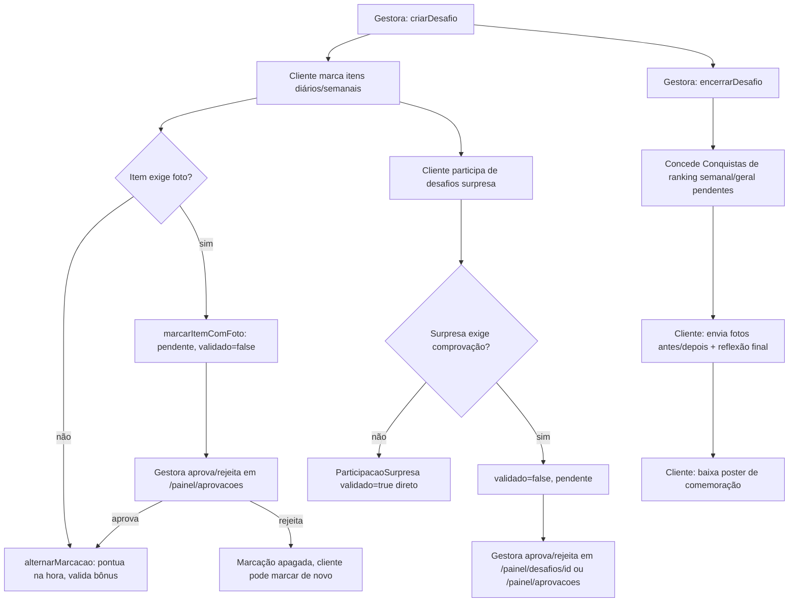

# Feature: Desafios

## Visão geral (sem jargão)

É o "cartão de fidelidade gamificado" da comunidade: uma vez por edição (normalmente mensal), a gestora monta um desafio com categorias de itens (ex.: "Alimentação" → "Beber 2L de água"), cada item vale pontos e pode ser marcado todo dia (ou toda semana). Quem marca mais itens sobe no ranking — que tem duas visões, a semana atual e o desafio inteiro. Por cima disso existem bônus (fazer um combo de itens no mesmo dia, completar uma categoria inteira, bater um limiar diário de itens marcados) e "desafios surpresa" avulsos, que rendem pontos extras. Ao final, cada cliente registra uma foto de "antes" e "depois" e escreve uma reflexão, e pode baixar uma imagem pronta para postar nas redes comemorando a conquista. Vencer o ranking ou cumprir um bônus concede **emblemas** — badges colecionáveis que aparecem no perfil público de quem tiver essa visibilidade ligada.

Alguns itens exigem **comprovação por foto** (ex.: "foto do prato saudável") — nesse caso a marcação fica pendente até a gestora aprovar manualmente, olhando a foto enviada, antes de contar pontos.

## Estrutura de arquivos

| Arquivo | Papel |
| --- | --- |
| `src/app/cliente/desafios/page.tsx` | Tela única da cliente: desafio ativo (itens do dia, surpresas, ranking) **ou**, se não há desafio ativo, o fluxo de encerramento do último desafio (ranking final, fotos, reflexão, poster) |
| `src/app/cliente/desafios/actions.ts` | `alternarMarcacao`, `marcarItemComFoto`, `participarDesafioSurpresa`, `enviarFotoAntes`/`enviarFotoDepois`, `marcarAvisoEncerramentoVisto`, `salvarReflexao` |
| `src/app/cliente/desafios/queries.ts` | `obterDesafioAtivoParaCliente`, `obterFluxoEncerramento` — inclui o cálculo de ranking (`calcularRanking`) |
| `src/app/cliente/desafios/botao-marcar-item.tsx`, `formulario-marcar-item-com-foto.tsx`, `formulario-participar-surpresa.tsx`, `formulario-reflexao.tsx`, `fotos-jornada.tsx`, `ranking-toggle.tsx`, `botao-continuar-encerramento.tsx` | Componentes client de cada interação (fotos de antes/depois em `fotos-jornada.tsx` e fotos de comprovação em `painel/aprovacoes` e `painel/desafios/[desafioId]` são exibidas com `ImagemSensivel` — ver [`docs/architecture.md`](../architecture.md#exibindo-imagens-sensíveis-imagemsensivel)) |
| `src/app/cliente/desafios/poster/route.tsx` | Route handler que gera (via `next/og` + `sharp`) a imagem "cartão de comemoração" para download |
| `src/app/painel/desafios/page.tsx`, `actions.ts`, `queries.ts` | Gestora cria/encerra/reabre edições de desafio |
| `src/app/painel/desafios/[desafioId]/page.tsx`, `actions.ts`, `queries.ts` | Gestão de categorias, itens, regras de bônus e desafios surpresa de **uma** edição |
| `src/app/painel/desafios/emblemas/page.tsx`, `actions.ts`, `queries.ts` | Catálogo de `Emblema` (nome, ícone, descrição) |
| `src/app/painel/aprovacoes/*` | Fila de aprovação **compartilhada** com identidade & acesso — aqui trata comprovações de item (`aprovarMarcacaoItem`/`rejeitarMarcacaoItem`) e de desafio surpresa (reusa `aprovarParticipacao`/`rejeitarParticipacao` de `painel/desafios/[desafioId]/actions.ts`); ver [`docs/features/identidade-acesso.md`](./identidade-acesso.md#integração-com-outras-features) |
| `src/lib/desafios/conquistas.ts` | Cálculo de ranking para premiação e verificação/concessão de `Conquista` (bônus, ranking semanal, ranking geral) |
| `src/lib/emblemas/icones.ts` | Catálogo fixo de ícones (Lucide) disponíveis para um `Emblema` |
| `src/lib/storage/comprovantes-item-desafio.ts`, `comprovantes-surpresa.ts`, `jornada-desafio.ts` | Upload/validação/compressão/delete das fotos de cada um dos três fluxos de foto (comprovação de item, comprovação de surpresa, jornada antes/depois) — três módulos praticamente idênticos, só a pasta de destino no R2 muda |

## Models envolvidos

Ver [`../database.md`](../database.md#desafios--ver-docsfeaturesdesafiosmd) para os campos completos: `Desafio`, `CategoriaDesafio`, `ItemDesafio`, `MarcacaoItem`, `RegraBonus`, `DesafioSurpresa`, `ParticipacaoSurpresa`, `Emblema`, `Conquista`, `JornadaDesafio`.

## Rotas e Server Actions

| Action | O que faz | Gate | Models |
| --- | --- | --- | --- |
| `criarDesafio` (`painel/desafios/actions.ts`) | Cria uma nova edição; recusa se já existir um `Desafio.ativo` | `requererAcessoPainel()` | `Desafio` |
| `encerrarDesafio(id)` | `ativo:false` + roda a verificação final de conquistas de ranking (semanal e geral) | `requererAcessoPainel()` | `Desafio`, `Conquista` |
| `reabrirDesafio(id)` | Volta `ativo:true`; recusa se **outro** desafio já estiver ativo | `requererAcessoPainel()` | `Desafio` |
| `criarCategoria`/`removerCategoria` | CRUD de `CategoriaDesafio` (remover é cascade: leva itens e marcações) | `requererAcessoPainel()` | `CategoriaDesafio` |
| `criarItem`/`removerItem`/`alternarExigeFoto` | CRUD de `ItemDesafio`, incluindo ligar/desligar a exigência de foto | `requererAcessoPainel()` | `ItemDesafio` |
| `criarRegraLimiar`/`criarRegraCombo`/`criarRegraCategoriaCompleta`/`removerRegraBonus` | CRUD de `RegraBonus`, um construtor por `TipoBonus` | `requererAcessoPainel()` | `RegraBonus` |
| `criarDesafioSurpresa`/`removerDesafioSurpresa` | CRUD de `DesafioSurpresa` | `requererAcessoPainel()` | `DesafioSurpresa` |
| `aprovarParticipacao`/`rejeitarParticipacao` | Aprova (`validado:true` + apaga a foto do R2) ou rejeita (apaga a `ParticipacaoSurpresa` inteira + a foto) uma participação em desafio surpresa | `requererAcessoPainel()` | `ParticipacaoSurpresa` |
| `criarEmblema`/`removerEmblema` (`emblemas/actions.ts`) | CRUD do catálogo de emblemas; remover um emblema já concedido é bloqueado (violação de FK tratada explicitamente) | `requererAcessoPainel()` | `Emblema` |
| `aprovarMarcacaoItem`/`rejeitarMarcacaoItem` (`painel/aprovacoes/actions.ts`) | Aprova (`validado:true`, apaga foto do R2, roda verificação de conquistas) ou rejeita (apaga a `MarcacaoItem` inteira) uma marcação pendente de comprovação | `requererAcessoPainel()` | `MarcacaoItem`, `Conquista` |
| `alternarMarcacao(itemId)` | Toggle de marcação para item **sem** foto; ao marcar, roda verificação de bônus/ranking na hora | `requererPapel(["CLIENTE"])` | `MarcacaoItem`, `Conquista` |
| `marcarItemComFoto(itemId, formData)` | Cria a marcação **pendente** (`validado:false`) para item que exige foto; não roda verificação de bônus até ser aprovada | `requererPapel(["CLIENTE"])` | `MarcacaoItem` |
| `participarDesafioSurpresa(id, formData)` | Participa de um desafio surpresa; se `exigeComprovacao`, cria já com `validado:false` | `requererPapel(["CLIENTE"])` | `ParticipacaoSurpresa` |
| `enviarFotoAntes`/`enviarFotoDepois` | Upsert de `JornadaDesafio`, substituindo a foto anterior (se houver) | `requererPapel(["CLIENTE"])` | `JornadaDesafio` |
| `salvarReflexao` | Upsert das 3 reflexões finais em `JornadaDesafio` | `requererPapel(["CLIENTE"])` | `JornadaDesafio` |
| `marcarAvisoEncerramentoVisto` | Marca que a cliente já viu o card de "o desafio terminou" | `requererPapel(["CLIENTE"])` | `JornadaDesafio` |
| `GET /cliente/desafios/poster` | Gera um PNG (via `next/og`) com fotos antes/depois, emblemas conquistados e reflexão do **último desafio encerrado** da cliente logada | Sessão via `auth()` (401 se ausente) | leitura de `Desafio`, `JornadaDesafio`, `Conquista` |

## Fluxos principais

### Ciclo de vida completo de uma edição

### Estados de uma `MarcacaoItem` (item que exige foto)

Documentado com precisão em `specs/002-comprovacao-foto-desafio/data-model.md` (confirmado linha a linha contra o código — sem divergência):

| Situação | `validado` | `fotoChave` | Conta no ranking/bônus? | Como sai desse estado |
| --- | --- | --- | --- | --- |
| Item sem `exigeFoto`, marcada | `true` (default) | `null` | Sim, na hora | `alternarMarcacao` desmarca (delete da linha) |
| Item com `exigeFoto`, aguardando decisão | `false` | chave da foto | Não | Gestora aprova → linha abaixo; rejeita → linha apagada por completo, cliente pode marcar de novo |
| Item com `exigeFoto`, aprovada | `true` | `null` (apagada do R2 na aprovação) | Sim | Sem caminho de "desmarcar" depois de aprovada |

Não existe um estado "rejeitada" persistido — rejeitar sempre apaga o registro (mesmo padrão em `ParticipacaoSurpresa`). Mudar `ItemDesafio.exigeFoto` depois de já existirem marcações **não** recalcula o `validado` das marcações passadas.

### Cálculo de pontos e ranking

`src/lib/desafios/conquistas.ts` e a função privada `calcularRanking` em `cliente/desafios/queries.ts` fazem, cada uma à sua maneira, a mesma soma: pontos de `MarcacaoItem` com `validado:true` (join até `ItemDesafio.pontos`) + pontos de `ParticipacaoSurpresa` com `validado:true` (via `DesafioSurpresa.pontos`) — **bônus de `RegraBonus` não entram na soma do ranking**, eles só concedem uma `Conquista` avulsa (um emblema), não pontos adicionais ao placar.

- **Ranking semanal**: filtra `MarcacaoItem.data` na janela da semana atual (calculada a partir de `Desafio.dataInicio`, semanas de 7 dias corridos desde o início — não desde domingo). Desafios surpresa **não entram no ranking semanal** — o comentário no próprio código (`queries.ts:43-44`) admite que "desafios surpresa não têm data/semana própria no schema", então só contam para o ranking geral.
- **Ranking geral**: soma tudo, sem filtro de data.
- Cada linha do ranking busca a foto de perfil da cliente via `gerarUrlAssinadaPerfil`, com fallback pra `User.image` (foto do Google) — uma chamada de assinatura de URL por cliente distinta no ranking, dentro de um `Promise.all`.

### Bônus e emblemas

`RegraBonus.tipo` decide qual condição `regraSatisfeitaHoje` (`src/lib/desafios/conquistas.ts:31-87`) avalia:

| Tipo | Condição |
| --- | --- |
| `LIMIAR_DIARIO` | Cliente tem `≥ limiarItens` marcações válidas **no dia** (qualquer categoria) |
| `COMBO` | Todos os itens de `itensCombo` foram marcados e validados **no mesmo dia** |
| `CATEGORIA_COMPLETA` | Todo `ItemDesafio` daquela `CategoriaDesafio` foi marcado e validado **no dia** |

`verificarConquistasBonus` roda a cada marcação bem-sucedida (ou aprovação de comprovação) e concede no máximo **uma** `Conquista` por par (cliente, regra) — a checagem `jaTem` usa `referencia: regra.id` para não conceder duas vezes o mesmo bônus à mesma cliente no mesmo desafio, mesmo que a condição volte a ser satisfeita em outro dia.

Ranking semanal e geral também concedem emblema, mas só se o `Desafio` tiver `emblemaRankingSemanalId`/`emblemaRankingGeralId` configurado:

- **Semanal**: `verificarConquistasRankingSemanal` roda a cada marcação **e** ao encerrar o desafio, iterando todas as semanas já **completas** (`semana < semanaAtual`) que ainda não têm `Conquista` com `referencia: "semana-N"`. Empate no topo do ranking daquela semana **concede o emblema a todas as vencedoras empatadas**, não só a uma.
- **Geral**: `verificarConquistaRankingGeral` só roda ao encerrar o desafio (não a cada marcação), concede uma vez por desafio, também com suporte a empate múltiplo.

### "Um ativo por vez" para `Desafio.ativo`

Ver [`../architecture.md`](../architecture.md#padrão-um-ativo-por-vez) para o padrão geral. Aqui a checagem é simples (não usa transação, porque só há uma escrita): `criarDesafio` e `reabrirDesafio` fazem `findFirst({ where: { ativo: true } })` e lançam `AppError` se já existir outro — não há proteção contra uma condição de corrida entre duas chamadas simultâneas (janela pequena, mas existe, já que a checagem e a escrita não estão na mesma transação/constraint).

## Integração com outras features

- **Identidade & acesso**: `/painel/aprovacoes` é uma página compartilhada com a aprovação de contas — ver [`identidade-acesso.md`](./identidade-acesso.md).
- **Emblemas** aparecem no perfil público (`/perfil/[clienteId]`) só se `Perfil.emblemasPublicos = true` — ver [`perfil.md`](./perfil.md#visibilidade-como-os-3-toggles--a-flag-por-foto-se-combinam).
- **Feed**: a home do feed mostra um "teaser" do desafio ativo (`obterTeaserDesafioAtivo`, em `feed/queries.ts`) linkando para `/cliente/desafios` — ver [`feed.md`](./feed.md).
- **Nav principal**: o item "Desafios" (`itens-navegacao-principal.ts`) aparece tanto para quem tem papel `CLIENTE` quanto para quem tem acesso ao painel (`GESTORA`/`ADMIN`) — a página é a mesma, mas a gestora vê em modo **somente leitura** (sem nenhum botão de ação), controlado pela flag `ehCliente` calculada em `cliente/desafios/page.tsx`.

## Pegadinhas e dívidas técnicas

- **`painel/desafios/emblemas/actions.ts` trata manualmente um caso avançado de erro do Prisma** (`ehViolacaoRestricaoFK`, em `removerEmblema`) para diferenciar uma violação de FK "solta" (código `P2003`) de uma violação de `RESTRICT` (que cai no fallback genérico `P2039` com o driver adapter `@prisma/adapter-pg`, exigindo checar `meta.driverAdapterError.cause`) — é o jeito de dar a mensagem amigável "esse emblema já foi concedido a alguém" em vez de deixar o erro genérico do `executarAction` cobrir esse caso.
- **`obterDesafioRelevante` (usado por `enviarFotoAntes`/`enviarFotoDepois`) aceita o desafio ativo OU o mais recente encerrado** — ou seja, a cliente ainda consegue enviar/trocar as fotos de jornada mesmo depois de o desafio ter encerrado (necessário para o fluxo de encerramento, que pede essas fotos só depois de o desafio já estar fechado), mas isso também significa que não há um prazo final para enviar essas fotos — a janela fica aberta indefinidamente até o **próximo** desafio ser criado.
- **`participarDesafioSurpresa` e `marcarItemComFoto` não limitam o tamanho/tipo do arquivo na Server Action** — a validação real acontece dentro de `uploadComprovante(Item)`/`uploadFotoJornada` (`validarArquivo`, 5MB, JPEG/PNG/WebP) e na leitura de magic bytes em `comprimir-imagem.ts`, então a proteção existe, só não é visível olhando só a action.
- **`RegraBonus` do tipo `COMBO`/`CATEGORIA_COMPLETA` não é reavaliada retroativamente** se um item for adicionado à categoria ou ao combo depois de a cliente já ter marcado todos os itens anteriores — a condição só é checada no momento de uma nova marcação, então a cliente precisaria marcar (ou desmarcar e remarcar) algum item para a conquista dedicada disparar depois da mudança no catálogo.
- A spec do spec-kit (`specs/002-comprovacao-foto-desafio/`) está alinhada com o código atual — nenhuma divergência encontrada na comparação linha a linha do `data-model.md` com o schema e as actions reais.
