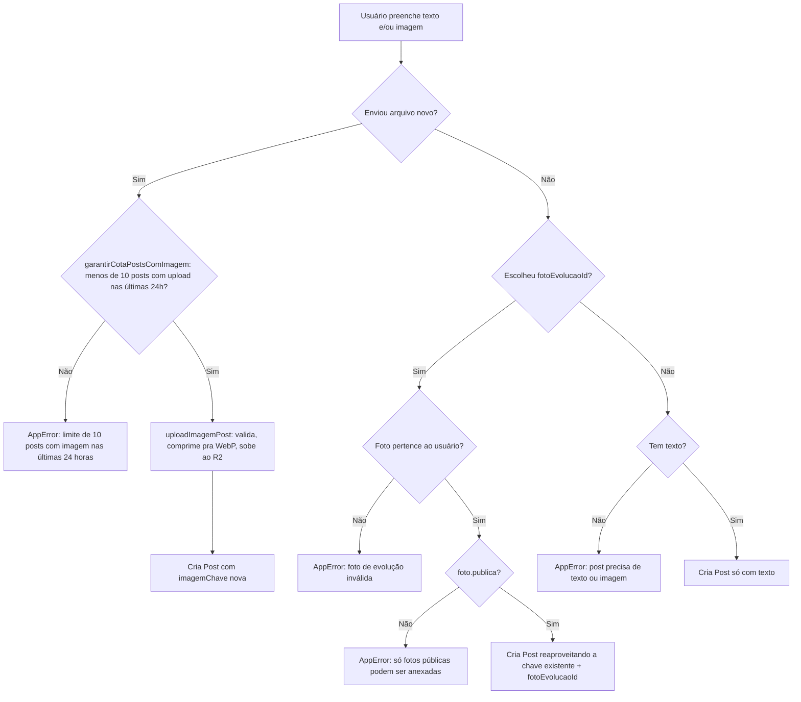
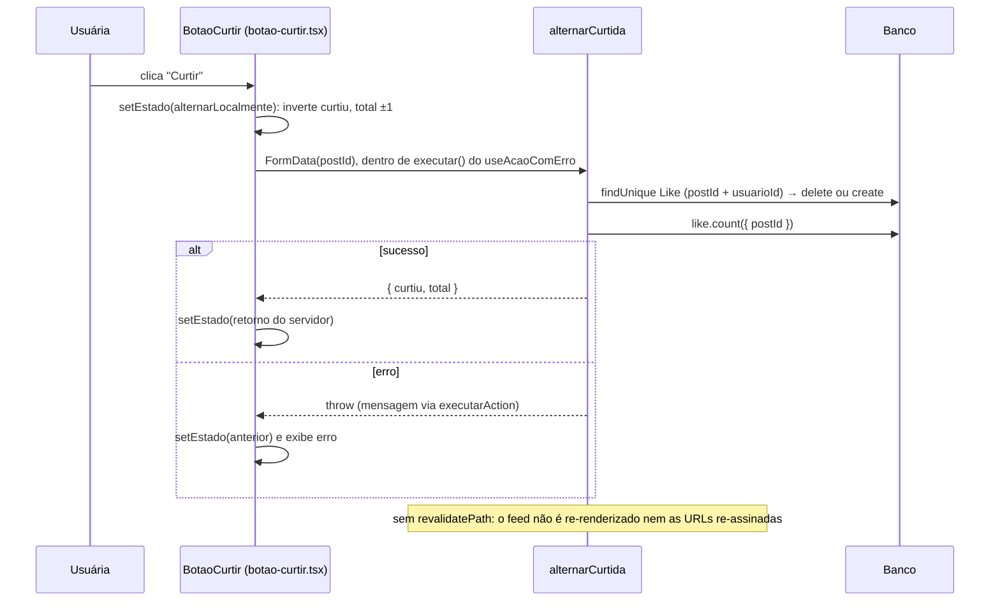
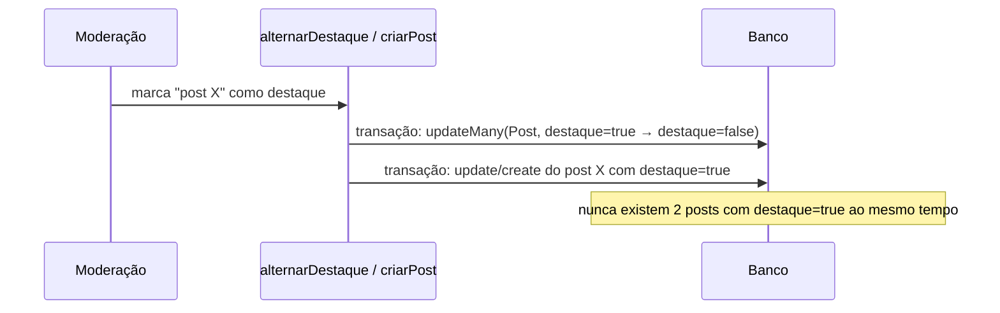

# Feature: Feed

## Visão geral (sem jargão)

É o mural da comunidade: qualquer cliente, parceria, gestora ou admin pode publicar um texto e/ou uma foto, curtir e comentar publicações de outras pessoas. É a feature mais "rede social" do produto.

Uma novidade recente é o **post fixado**: a administração pode escolher um post para ficar sempre no topo do feed, destacado, independente de quando foi publicado — pense em um mural físico onde alguém pode fixar um aviso importante com uma tachinha, na frente de tudo.

## Estrutura de arquivos

| Arquivo | Papel |
| --- | --- |
| `src/app/feed/page.tsx` | Lista de posts paginada por cursor + post fixado + teaser do desafio ativo |
| `src/app/feed/actions.ts` | `criarPost`, `alternarDestaque`, `editarPost`, `apagarPost`, `alternarCurtida`, `comentar`, `apagarComentario` |
| `src/app/feed/queries.ts` | `listarPosts`, `obterPostDestaque`, `obterPost`, `listarFotosEvolucaoDoUsuario` (só fotos **públicas** do usuário), `obterTeaserDesafioAtivo`. Assina a imagem do post com `gerarUrlAssinada` (5 min) quando há `fotoEvolucaoId` e com `gerarUrlAssinadaCacheavel` (estável por hora) quando é upload próprio; avatar da autora sempre cacheável |
| `src/app/feed/cartao-post.tsx` | Exibição de um post: imagem com zoom (via `ImagemSensivel` quando o post tem `fotoEvolucaoId`, `next/image` comum caso contrário), curtir, comentários, ações de dono/moderação |
| `src/app/feed/botao-alternar-destaque.tsx` | Botão de fixar/desafixar (só moderação) |
| `src/app/feed/botao-apagar-post.tsx` / `botao-apagar-comentario.tsx` | Excluir com confirmação |
| `src/app/feed/botao-curtir.tsx` | Toggle de curtida com atualização otimista (estado local `{ curtiu, total }`, reconciliado com o retorno da action; ver [Fluxo: curtir](#fluxo-curtir-atualização-otimista)) |
| `src/app/feed/formulario-comentario.tsx` | Novo comentário |
| `src/app/feed/novo/page.tsx` + `formulario-novo-post.tsx` | Criar post: texto, upload de imagem OU escolha de uma foto de evolução pública já enviada (miniaturas via `ImagemSensivel`; sem fotos públicas, mostra orientação para tornar uma pública em "Minhas fotos"), checkbox de destaque (só moderação) |
| `src/app/feed/[postId]/editar/page.tsx` + `formulario-editar-post.tsx` | Editar post: só o autor, pode trocar texto e/ou imagem |
| `src/lib/storage/posts.ts` | Upload/validação/compressão/delete da imagem do post no R2 |
| `src/lib/storage/cotas.ts` | `garantirCotaPostsComImagem` — cota de 10 posts com upload de imagem por autora a cada 24 horas (ver [Cota de posts com imagem](#cota-de-posts-com-imagem)) |

## Models envolvidos

Ver [`docs/database.md`](../database.md#feed--ver-docsfeaturesfeedmd).

- **`Post`** — `autorId`, `texto`, `imagemChave`, `fotoEvolucaoId` (opcional, aponta pra uma `FotoEvolucao` já existente), `destaque`.
- **`Like`** — único por `postId`+`usuarioId` (é um toggle, não um contador).
- **`Comentario`** — sem edição, só criação e exclusão.

## Rotas e Server Actions

| Action | O que faz | Gate | Models |
| --- | --- | --- | --- |
| `criarPost` | Cria post (texto e/ou imagem); se marcar destaque, exige moderação. Com arquivo novo, confere antes a cota de 24h da autora (`garantirCotaPostsComImagem`). Foto de evolução anexada precisa ser do próprio usuário **e** pública (`AppError("Só fotos de evolução públicas podem ser anexadas a um post")` caso contrário). Se a gravação falhar depois de um upload próprio, apaga o objeto recém-enviado e relança o erro | `requererSessao()`; `destaque=true` exige adicionalmente `requererAcessoPainel()` | `Post`, `FotoEvolucao` |
| `alternarDestaque(postId)` | Fixa/desafixa um post existente | `requererAcessoPainel()` (GESTORA/ADMIN) | `Post` |
| `editarPost` | Troca texto e/ou imagem; com imagem nova, sobe a nova → `update` → só então apaga a antiga (se era upload próprio) | `requererSessao()` + **só o autor** (moderador não pode editar conteúdo alheio) | `Post` |
| `apagarPost` | Exclui o post no banco e só depois apaga a imagem do R2 (se era upload próprio) | `requererSessao()` + autor **ou** GESTORA/ADMIN | `Post` |
| `alternarCurtida` | Curte/descurte e devolve `{ curtiu, total }` (estado novo + `like.count` do post). **Não** chama `revalidatePath` | `requererSessao()` | `Like` |
| `comentar` | Adiciona comentário | `requererSessao()` | `Comentario` |
| `apagarComentario` | Exclui comentário | `requererSessao()` + autor do comentário **ou** GESTORA/ADMIN | `Comentario` |

Moderação pode **apagar** post/comentário de qualquer pessoa, mas nunca **editar** conteúdo alheio — só quem escreveu edita o próprio texto/imagem.

## Fluxo: criar post (imagem nova vs. foto de evolução)

O formulário de novo post oferece duas fontes de imagem, mutuamente exclusivas:

1. Upload de um arquivo novo (`input type="file"`).
2. Escolher, por um rádio, uma foto já enviada em "Minhas fotos" (`FotoEvolucao` do próprio usuário) — **só aparecem as fotos marcadas como públicas**. Se a pessoa não tiver nenhuma foto pública, o seletor não aparece e o formulário mostra a orientação "Para anexar uma foto de evolução ao post, torne uma foto pública em Minhas fotos."

### Cota de posts com imagem

**Em linguagem simples:** cada pessoa pode publicar até 10 posts com foto enviada do aparelho a cada 24 horas (janela móvel, não por dia do calendário). Posts só de texto e posts que reaproveitam uma foto de evolução não contam.

`garantirCotaPostsComImagem(autorId)` (`src/lib/storage/cotas.ts`) conta os `Post` da autora com `imagemChave` preenchida, `fotoEvolucaoId` nulo e `criadoEm >= agora - 24h`. Se o total já for `>= LIMITE_POSTS_COM_IMAGEM_POR_JANELA` (10), lança `AppError("Você atingiu o limite de 10 posts com imagem nas últimas 24 horas. Tente novamente mais tarde.")`.

| Situação | Consome/checa a cota? | Por quê |
| --- | --- | --- |
| `criarPost` com arquivo novo | Sim, **antes** de `uploadImagemPost` (cota estourada = nada vai ao R2) | É o único caminho que grava um objeto novo no R2 |
| `criarPost` com `fotoEvolucaoId` | Não | Reaproveita o objeto da foto de evolução, sem upload (a contagem também ignora esses posts) |
| `criarPost` só com texto | Não | Sem imagem |
| `editarPost` trocando a imagem | Não | A troca apaga do R2 a imagem antiga do post (quando era upload próprio), então o número de objetos da autora não cresce |

Apagar um post com imagem dentro da janela libera uma vaga, porque a contagem olha os posts que existem no banco. Visão geral de todas as cotas: [`docs/architecture.md`](../architecture.md#cotas-de-upload-por-usuária).

### Imagem do post e banco sempre em sincronia

**Em linguagem simples:** o post e a sua imagem são gravados em lugares diferentes (banco e R2). O feed nunca deve mostrar um post com imagem quebrada; por isso, se algo der errado no meio do caminho, o app desfaz a parte do R2 em vez de deixar o banco apontando para um arquivo inexistente. E a imagem de uma foto de evolução nunca é apagada por uma ação de post — ela pertence à galeria da cliente.

| Action | Ordem | Se o banco falhar | Imagem que pode ser apagada |
| --- | --- | --- | --- |
| `criarPost` | Upload (só se veio arquivo) → validação "texto ou imagem" + `create` (ou `$transaction` de destaque), tudo no mesmo `try` | Apaga o objeto recém-enviado e relança | Só o upload próprio desta chamada (flag `uploadProprio`); com `fotoEvolucaoId`, nada é apagado |
| `editarPost` | Validação "texto ou imagem" **antes** do upload → upload da nova → `update` (no `try`) → apaga a antiga | Apaga a imagem nova e relança; o post continua com a antiga | A antiga, só se `post.fotoEvolucaoId` era nulo |
| `apagarPost` | `post.delete` → apaga a imagem | Nada é tocado no R2 | A imagem do post, só se `post.fotoEvolucaoId` é nulo |

Toda remoção usa `apagarObjetoEmMelhorEsforco` (`src/lib/storage/objetos.ts`): se o R2 falhar ao apagar, a falha é logada e a action conclui normalmente. Regra geral em [`docs/architecture.md`](../architecture.md#consistência-entre-banco-e-r2-o-banco-é-a-fonte-da-verdade).

### Regra: só foto de evolução pública vai para o feed

**Em linguagem simples:** a foto de evolução é da cliente e nasce privada. Ela só pode aparecer no feed se a própria cliente a tiver deixado pública; e, se ela voltar atrás (tornar privada ou excluir a foto), os posts que mostravam aquela foto somem do feed junto.

A regra é aplicada em camadas:

| Camada | Onde | O que faz |
| --- | --- | --- |
| Listagem do seletor | `listarFotosEvolucaoDoUsuario` (`src/app/feed/queries.ts`) | Filtra `{ clienteId: usuarioId, publica: true }` |
| Criação | `criarPost` (`src/app/feed/actions.ts`) | Rejeita com `AppError` foto privada mesmo que o id chegue no `FormData` |
| Edição | `editarPost` | Nunca anexa foto de evolução — só mantém a imagem atual ou a troca por upload novo (nesse caso `fotoEvolucaoId` vira `null`) |
| Revogação | `alternarVisibilidadeFoto` / `excluirFoto` (`src/app/cliente/fotos/actions.ts`) | Apagam, numa `$transaction`, os `Post` com aquele `fotoEvolucaoId` **e** `autorId` da cliente logada (`deleteMany({ where: { fotoEvolucaoId, autorId } })`; curtidas e comentários saem por cascade) e revalidam `/feed` — ver [`docs/features/perfil.md`](./perfil.md#fluxo-fotos-de-evolução) |

Na exibição, a imagem de um post com `fotoEvolucaoId` é renderizada com `ImagemSensivel` (sem passar pelo otimizador do Next), tanto em `cartao-post.tsx` quanto na lista de posts de `/perfil/[clienteId]` — ver [`docs/architecture.md`](../architecture.md#exibindo-imagens-sensíveis-imagemsensivel).

Imagens de post com upload próprio (sem `fotoEvolucaoId`) recebem URL assinada **cacheável** (`gerarUrlAssinadaCacheavel`, a mesma URL durante a hora cheia), o que permite ao navegador e ao otimizador do Next reaproveitar a imagem entre carregamentos do feed; imagens com `fotoEvolucaoId` continuam com a URL de 5 minutos. Ver [`docs/architecture.md`](../architecture.md#dois-tipos-de-url-assinada-efêmera-vs-cacheável).

## Fluxo: curtir (atualização otimista)

**Em linguagem simples:** ao tocar em "Curtir", o coração e o contador mudam na hora, sem esperar o servidor. Em seguida o servidor confirma e o botão se ajusta ao número real (se outra pessoa curtiu ao mesmo tempo, o total já vem certo). Se der erro, o botão volta ao que era antes e mostra a mensagem.

Comentar continua do jeito antigo: `comentar` chama `revalidatePath("/feed")` e a tela só reflete o comentário depois do round-trip (botão desabilitado via `isPending` enquanto isso).

| Detalhe | Comportamento (`src/app/feed/botao-curtir.tsx`) |
| --- | --- |
| Estado inicial | `useState({ curtiu: curtidoPeloUsuario, total: totalCurtidas })`, vindo das props do servidor |
| Re-render do feed por outro motivo (comentário, post apagado) | O componente guarda as props anteriores; se `curtidoPeloUsuario` ou `totalCurtidas` mudarem, o estado local é substituído pelos valores do servidor |
| Durante a requisição | Botão `disabled={isPending}`, o que impede cliques repetidos enquanto a action roda |
| Falha | Restaura o estado anterior e relança o erro para o `useAcaoComErro` exibir em `role="alert"` |

Como `alternarCurtida` não revalida, outras partes da página que mostram curtidas (se houver) só se atualizam no próximo render vindo do servidor. Ao criar uma nova tela que exiba o total de curtidas, use `BotaoCurtir` ou consuma o retorno `{ curtiu, total }` em vez de depender de revalidação.

## Fluxo: post em destaque ("um ativo por vez")

Só GESTORA/ADMIN pode fixar um post — tanto pelo checkbox ao criar quanto pelo botão de alternar em qualquer post já publicado.

A mutualidade é garantida por `prisma.$transaction([...])` — o mesmo padrão usado em `Desafio.ativo` e `CicloPacote.ativo` (ver [`docs/architecture.md`](../architecture.md#padrão-um-ativo-por-vez)). Desfixar (post já em destaque) não precisa de transação — é um único `update`, sem concorrência com outro registro. Ao excluir o post que estava em destaque, nenhum outro é promovido automaticamente: o feed simplesmente fica sem post fixado até alguém escolher um novo (comportamento intencional, documentado em `specs/004-post-destaque-feed/spec.md`).

Na listagem, `listarPosts` filtra explicitamente `destaque: false` para não duplicar o post fixado na lista cronológica — ele aparece só uma vez, sempre no topo, renderizado antes da lista normal em `page.tsx`.

## Zoom em fotos

O zoom (commit "adiciona zoom em fotos no feed, perfil, desafios e aprovações") é um componente compartilhado, `FotoComZoom`, usado como wrapper em volta da imagem do post em `cartao-post.tsx` — não é uma implementação duplicada por página, é reaproveitado nas outras telas citadas no commit.

## Pegadinhas e dívidas técnicas

- **Paginação é por cursor, não infinite scroll**: `listarPosts` usa `cursor`/`skip: 1`/`take: 11`, e a UI oferece um link "Carregar mais" que recarrega a página com `?cursor=` — não há scroll infinito nem fetch incremental no client.
- **Editar post pode trocar a imagem**, não só o texto. Se a imagem antiga era um upload próprio do post (`imagemChave` sem `fotoEvolucaoId`), o arquivo antigo é apagado do R2 ao trocar — sempre **depois** do `update` do post confirmar (ver [Imagem do post e banco sempre em sincronia](#imagem-do-post-e-banco-sempre-em-sincronia)). Se a imagem antiga era uma `FotoEvolucao` reaproveitada, ela **não** é apagada (correto — pertence à galeria pessoal, não ao post). A edição não permite trocar por uma foto de evolução da galeria — só por upload de arquivo novo ou manter a atual.
- **Post com foto de evolução pode desaparecer sem ação no feed**: a cliente tornar a foto privada ou excluí-la em "Minhas fotos" apaga o post inteiro (texto, curtidas e comentários incluídos), não só a imagem. É intencional; a UI de "Minhas fotos" avisa quantos posts serão apagados antes de confirmar. O `deleteMany` filtra por `fotoEvolucaoId` **e** `autorId` da cliente; como `criarPost` só aceita foto de evolução da própria autora, isso cobre todos os posts daquela foto. Se um dia surgir outro caminho que anexe foto de evolução a post de outra pessoa, revise esse filtro junto.
- **Curtida não revalida o feed**: o total exibido é o retornado pela action para aquele botão. Testes e telas novas não devem esperar `revalidatePath("/feed")` depois de `alternarCurtida`.
- **`obterPostAutorizado` tem nome enganoso**: confirma só que a pessoa pode "acessar" o post (autor ou moderador) para fins de exclusão; `editarPost` precisa reforçar manualmente, depois, que só o autor pode editar. Quem reusar essa função deve tratar a permissão de edição separadamente.
