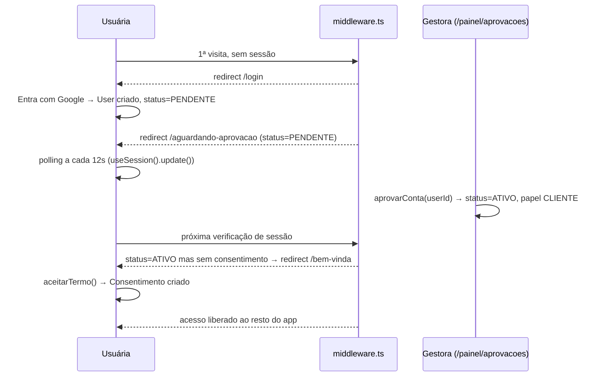
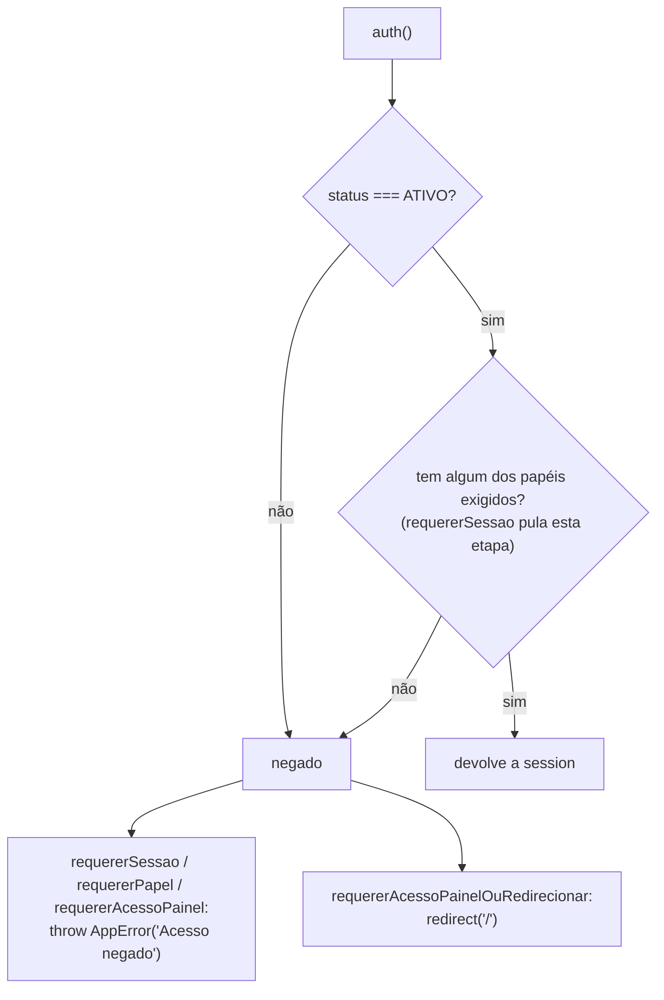

# Identidade & acesso

## Visão geral (não técnica)

É o "departamento de recursos humanos e portaria" do app. Cuida de três coisas: como alguém entra (login com a conta Google, sem senha própria), o que acontece entre o cadastro e o acesso liberado (uma aprovação manual da gestora, como um clube que confirma cada sócio novo antes de liberar a catraca), e quem pode fazer o quê depois de dentro (o papel de cada pessoa: cliente, parceria profissional, gestora ou admin). Também cuida do termo de consentimento (LGPD) que toda pessoa ativa precisa aceitar uma vez antes de usar o resto do app.

## Responsabilidades

- Autenticar via Google e manter a sessão.
- Levar a pessoa recém-cadastrada por um funil: login → aguardar aprovação → aceitar termo → acesso liberado.
- Guardar e checar o papel (`Papel`) de cada conta, em qualquer combinação.
- Permitir à gestora aprovar/rejeitar contas novas, suspender/reativar, promover a Parceria/Gestora, e excluir contas (com limpeza de arquivos).
- Impedir que a comunidade fique sem nenhuma conta `ADMIN`/`GESTORA` ativa.

## Arquivos

| Arquivo | Papel |
| --- | --- |
| `src/auth.ts` | Configuração do NextAuth v5: provider Google, adapter Prisma, sessão em banco, enriquecimento da sessão |
| `src/app/api/auth/[...nextauth]/route.ts` | Route handler que expõe os endpoints do NextAuth (`/api/auth/*`) |
| `middleware.ts` | Gate de status de conta/consentimento em toda rota (exceto `/login`, `/api/auth`) |
| `src/lib/auth/route-decision.ts` | Função pura `decideRoute()` — a lógica de redirecionamento, testável isoladamente |
| `src/lib/auth/enrich-session.ts` | Injeta `status`, `papeis`, `temConsentimento` na sessão do NextAuth |
| `src/lib/auth/pode-acessar-painel.ts` | Funções booleanas de papel para Server Components/layouts (`podeAcessarPainel`, `podeAcessarAreaCliente`, `podeAcessarAreaParceria`, `podeAcessarDesafiosCliente`, `temAlgumPapel`) |
| `src/lib/auth/requerer-acesso-painel.ts` | Gates do servidor, todos exigindo conta `ATIVO`: `requererSessao`, `requererPapel`, `requererAcessoPainel` (lançam `AppError`) e `requererAcessoPainelOuRedirecionar` (redireciona para `/`, usada nas leituras do painel) — ver [Gates no servidor](#gates-no-servidor-conta-ativa--papel) |
| `src/lib/nome-exibicao.ts` | `nomeParaExibicao(nome)` — nome mostrado a **outra** usuária, com fallback `"Membra da comunidade"` (nunca o e-mail) |
| `src/lib/auth/deve-mostrar-nav.ts` | Decide se a navegação principal aparece (só quando `ATIVO` + `temConsentimento`) |
| `src/lib/nav/itens-navegacao-principal.ts` | Monta os itens de menu visíveis conforme o papel |
| `src/lib/consentimento/versao-termo.ts` | Versão atual do termo (`VERSAO_TERMO_ATUAL`) |
| `src/lib/auth/actions.ts` | Server Action `sair()` (logout) |
| `src/app/login/page.tsx`, `actions.ts` | Tela de login e a action `entrarComGoogle()` |
| `src/app/bem-vinda/page.tsx`, `actions.ts` | Tela do termo de consentimento e a action `aceitarTermo()` |
| `src/app/aguardando-aprovacao/page.tsx` | Tela de espera, faz polling de sessão a cada 12s até o status mudar |
| `src/app/conta-suspensa/page.tsx` | Tela informativa para conta suspensa |
| `src/app/painel/aprovacoes/*` | Fila de aprovação de contas (e também de comprovações de desafio — ver `desafios.md`) |
| `src/app/painel/membros/page.tsx`, `actions.ts`, `queries.ts` | Lista de membros e gestão de status/papéis (suspender, reativar, deletar, promover/revogar Parceria e Gestora) |

## Models envolvidos

`User`, `UsuarioPapel`, `Consentimento`, `Account`, `Session`, `VerificationToken` — ver [`../database.md`](../database.md#identidade--acesso--ver-docsfeaturesidentidade-acessomd).

## Rotas e Server Actions

| Rota/Action | O que faz | Gate | Models |
| --- | --- | --- | --- |
| `entrarComGoogle()` (`login/actions.ts`) | Inicia o fluxo OAuth do Google | Nenhum (é o próprio login) | — |
| `sair()` (`lib/auth/actions.ts`) | Logout (`signOut`) | Nenhum — funciona para conta em qualquer status (usado em `/aguardando-aprovacao` e `/conta-suspensa`) | `Session` (removida) |
| `aceitarTermo()` (`bem-vinda/actions.ts`) | Cria/atualiza `Consentimento` com a versão atual do termo | `auth()` direto + checagem de `session.user.id` (`AppError("Sessão inválida")`). **Não** usa `requererSessao`, de propósito: o funil de entrada não pode depender do gate que exige `ATIVO` | `Consentimento` |
| `GET /painel/aprovacoes`, `GET /painel/membros` (leitura) | Fila de contas pendentes e lista de membros | `requererAcessoPainelOuRedirecionar` no `page.tsx` e em cada função de `queries.ts` | `User`, `UsuarioPapel` |
| `/painel/aprovacoes` → `aprovarConta(userId)` | `status: "ATIVO"` + garante papel `CLIENTE` (transação) | `requererAcessoPainel` | `User`, `UsuarioPapel` |
| `/painel/aprovacoes` → `rejeitarConta(userId)` | Deleta o `User` pendente | `requererAcessoPainel` | `User` |
| `/painel/membros` → `suspenderMembro(userId)` | `status: "SUSPENSO"` | `requererAcessoPainel` + não pode ser a própria conta + não pode zerar admins/gestoras ativos | `User` |
| `/painel/membros` → `reativarMembro(userId)` | `status: "ATIVO"` | `requererAcessoPainel` | `User` |
| `/painel/membros` → `deletarMembro(userId)` | Lista as chaves de arquivos do usuário (`listarChavesDoUsuario`: perfil, perfil de parceria, fotos de evolução, jornada, comprovações de surpresa, comprovações de item, posts, planos — sem duplicatas), deleta o `User` (cascata no banco) e só depois apaga esses objetos do R2 em melhor esforço | `requererAcessoPainel` + não a própria conta + não a última admin/gestora ativa | `User` e cascata |
| `/painel/membros` → `promoverAParceria` / `revogarParceria(userId)` | Adiciona/remove papel `PARCERIA`; revogar também desativa todos os vínculos onde essa pessoa é a parceria | `requererAcessoPainel` | `UsuarioPapel`, `VinculoParceria` |
| `/painel/membros` → `promoverAGestora` / `revogarGestora(userId)` | Adiciona/remove papel `GESTORA` | `requererAcessoPainel` **+ precisa ser `ADMIN`** (`garantirEhAdmin`) — só um ADMIN gerencia o papel Gestora | `UsuarioPapel` |

## Fluxos principais

### Do cadastro ao acesso liberado

### Gates no servidor: conta ativa + papel

**Em linguagem simples:** o middleware é o recepcionista que encaminha cada pessoa para a sala certa. Mas cada sala com dados tem o próprio leitor de crachá na porta, e esse leitor confere duas coisas: se a conta está **ativa** (aprovada e não suspensa) e se a pessoa tem o papel exigido ali. Por isso, uma conta pendente ou suspensa não lê nem grava nada protegido, mesmo que chegue à porta por outro caminho.

**Detalhe técnico.** `src/lib/auth/requerer-acesso-painel.ts` define uma checagem interna `contaAtiva(session)` (`session?.user?.status === "ATIVO"`) usada pelas quatro funções exportadas:

| Função | Papéis exigidos | Negado → | Uso típico |
| --- | --- | --- | --- |
| `requererSessao()` | nenhum (só conta `ATIVO`) | `AppError("Acesso negado")` | `src/app/feed/actions.ts` |
| `requererPapel(papeis)` | ao menos um de `papeis` | `AppError("Acesso negado")` | actions e queries de `cliente/*` e `parceria/*` |
| `requererAcessoPainel()` | `GESTORA` ou `ADMIN` | `AppError("Acesso negado")` | actions de `painel/*` |
| `requererAcessoPainelOuRedirecionar()` | `GESTORA` ou `ADMIN` | `redirect("/")` | início de todo `page.tsx` e de toda função de `queries.ts` em `src/app/painel/**` |

Regra de projeto ("autorização perto dos dados", também em `CLAUDE.md`): o `painel/layout.tsx` (com `podeAcessarPainel`) e o middleware continuam existindo para a navegação ficar confortável, mas a checagem que vale é a que roda junto da leitura ou escrita. Lista completa das telas do painel cobertas em [`docs/architecture.md`](../architecture.md#gates-de-acesso).

**O funil de entrada fica de fora de propósito.** `/aguardando-aprovacao` (polling com `useSession().update()`), `/bem-vinda` (`aceitarTermo`, com `auth()` direto), `/conta-suspensa` e `sair()` atendem contas que ainda não estão liberadas, então não chamam esses gates. Os testes `src/app/bem-vinda/actions.test.ts` e `src/lib/auth/actions.test.ts` garantem que `aceitarTermo` e `sair` funcionam com conta `PENDENTE`/`SUSPENSO`.

### Nome exibido para outra usuária

Quando uma usuária aparece na tela de outra (ranking de desafios, parcerias e planos da cliente, medidas e planos da parceria), o nome passa por `nomeParaExibicao` (`src/lib/nome-exibicao.ts`): nome vazio ou ausente vira `"Membra da comunidade"`, e as queries dessas telas não selecionam `email`. Só o painel (gestora/admin) mostra `name ?? email`. Lista de telas em [`docs/architecture.md`](../architecture.md#nome-exibido-para-outra-usuária-nomeparaexibicao).

### Gestão de papéis e o "último admin"

`garantirNaoUltimoAdminOuGestoraAtivo` (`painel/membros/actions.ts:25-40`) conta quantas **outras** contas `ATIVO` têm papel `ADMIN` ou `GESTORA`; se zero, bloqueia suspender/deletar/revogar-gestora com um `AppError` explicando o motivo. Isso evita o cenário "ninguém mais consegue administrar a comunidade". A mesma trava não existe para `PARCERIA` (revogar parceria nunca é bloqueado por esse motivo).

## Integração com outras features

- **Desafios**: `painel/aprovacoes` é uma tela compartilhada — a mesma fila de "pendências" mostra tanto contas quanto comprovações de item/desafio-surpresa (ver `desafios.md`). A aprovação de conta e a aprovação de comprovação são, tecnicamente, duas features diferentes compartilhando uma página.
- **Todas as outras features**: dependem de `requererPapel`/`requererAcessoPainel`/`requererSessao` nas Server Actions e queries, de `requererAcessoPainelOuRedirecionar` nas leituras do painel, e de `podeAcessarAreaCliente`/`podeAcessarAreaParceria`/`podeAcessarPainel` nos layouts (navegação). Telas em que uma usuária vê outra usam `nomeParaExibicao`.
- **Feed**: o campo `session.user.papeis` (populado aqui) decide quem pode moderar (`GESTORA`/`ADMIN`) e quem pode fixar um post no topo.

## Pegadinhas e dívidas técnicas

- **`VERSAO_TERMO_ATUAL = "v2-rascunho"`** (`src/lib/consentimento/versao-termo.ts:1`) — o nome sugere que o termo ainda está em rascunho/não finalizado. Trocar essa constante força todo mundo a reaceitar o termo (porque `aceitarTermo` faz `upsert` comparando/gravando essa versão), então é um interruptor sensível.
- **Rejeitar uma conta pendente é destrutivo e imediato** (`rejeitarConta` faz `prisma.user.delete` direto, sem soft-delete) — não há tela de "lixeira" nem confirmação em duas etapas além do `BotaoComConfirmacao` da UI.
- **`deletarMembro` segue a ordem "banco primeiro, R2 depois"**: as chaves precisam ser listadas **antes** do `user.delete` (o `onDelete: Cascade` apaga as linhas que as guardam), mas os objetos só são apagados do R2 **depois** que o banco confirmou a exclusão, via `apagarObjetoEmMelhorEsforco` em paralelo. Se o `user.delete` falhar, nenhum arquivo é tocado; se o R2 falhar ao apagar algum objeto, a falha é só logada e a exclusão do membro conclui. Ver [`docs/architecture.md`](../architecture.md#consistência-entre-banco-e-r2-o-banco-é-a-fonte-da-verdade).
- **A trava de "último admin/gestora"** conta só contas com **status `ATIVO`** — uma conta `SUSPENSO` com papel `ADMIN` não conta como proteção, o que é a intenção, mas vale ter isso em mente ao debugar "por que consegui suspender mesmo achando que era a última".
- **Status na sessão vem do banco a cada request** (`enrichSession`), então suspender uma conta faz os gates do servidor negarem a próxima leitura/escrita dela, sem esperar o middleware redirecionar. Em testes de integração que chamam actions/queries diretamente, o mock de sessão precisa incluir `status: "ATIVO"` — sem isso os gates negam o acesso.
