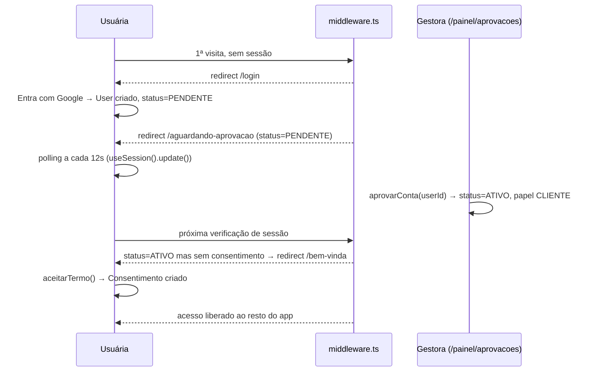

# Identidade & acesso

## Visão geral (não técnica)

É o "departamento de recursos humanos e portaria" do app. Cuida de três coisas: como alguém entra (login com a conta Google, sem senha própria), o que acontece entre o cadastro e o acesso liberado (uma aprovação manual da gestora, como um clube que confirma cada sócio novo antes de liberar a catraca), e quem pode fazer o quê depois de dentro (o papel de cada pessoa: cliente, parceria profissional, gestora ou admin). Também cuida do termo de consentimento (LGPD) que toda pessoa ativa precisa aceitar uma vez antes de usar o resto do app.

## Responsabilidades

- Autenticar via Google e manter a sessão.
- Levar a pessoa recém-cadastrada por um funil: login → aguardar aprovação → aceitar termo → acesso liberado.
- Guardar e checar o papel (`Papel`) de cada conta, em qualquer combinação.
- Permitir à gestora aprovar/rejeitar contas novas, suspender/reativar, promover a Parceria/Gestora, e excluir contas (com limpeza de arquivos).
- Impedir que a comunidade fique sem nenhuma conta `ADMIN`/`GESTORA` ativa.

## Arquivos

| Arquivo | Papel |
| --- | --- |
| `src/auth.ts` | Configuração do NextAuth v5: provider Google, adapter Prisma, sessão em banco, enriquecimento da sessão |
| `src/app/api/auth/[...nextauth]/route.ts` | Route handler que expõe os endpoints do NextAuth (`/api/auth/*`) |
| `middleware.ts` | Gate de status de conta/consentimento em toda rota (exceto `/login`, `/api/auth`) |
| `src/lib/auth/route-decision.ts` | Função pura `decideRoute()` — a lógica de redirecionamento, testável isoladamente |
| `src/lib/auth/enrich-session.ts` | Injeta `status`, `papeis`, `temConsentimento` na sessão do NextAuth |
| `src/lib/auth/pode-acessar-painel.ts` | Funções booleanas de papel para Server Components/layouts (`podeAcessarPainel`, `podeAcessarAreaCliente`, `podeAcessarAreaParceria`, `podeAcessarDesafiosCliente`, `temAlgumPapel`) |
| `src/lib/auth/requerer-acesso-painel.ts` | Funções que lançam `AppError` para Server Actions/queries (`requererSessao`, `requererPapel`, `requererAcessoPainel`) |
| `src/lib/auth/deve-mostrar-nav.ts` | Decide se a navegação principal aparece (só quando `ATIVO` + `temConsentimento`) |
| `src/lib/nav/itens-navegacao-principal.ts` | Monta os itens de menu visíveis conforme o papel |
| `src/lib/consentimento/versao-termo.ts` | Versão atual do termo (`VERSAO_TERMO_ATUAL`) |
| `src/lib/auth/actions.ts` | Server Action `sair()` (logout) |
| `src/app/login/page.tsx`, `actions.ts` | Tela de login e a action `entrarComGoogle()` |
| `src/app/bem-vinda/page.tsx`, `actions.ts` | Tela do termo de consentimento e a action `aceitarTermo()` |
| `src/app/aguardando-aprovacao/page.tsx` | Tela de espera, faz polling de sessão a cada 12s até o status mudar |
| `src/app/conta-suspensa/page.tsx` | Tela informativa para conta suspensa |
| `src/app/painel/aprovacoes/*` | Fila de aprovação de contas (e também de comprovações de desafio — ver `desafios.md`) |
| `src/app/painel/membros/page.tsx`, `actions.ts`, `queries.ts` | Lista de membros e gestão de status/papéis (suspender, reativar, deletar, promover/revogar Parceria e Gestora) |

## Models envolvidos

`User`, `UsuarioPapel`, `Consentimento`, `Account`, `Session`, `VerificationToken` — ver [`../database.md`](../database.md#identidade--acesso--ver-docsfeaturesidentidade-acessomd).

## Rotas e Server Actions

| Rota/Action | O que faz | Gate | Models |
| --- | --- | --- | --- |
| `entrarComGoogle()` (`login/actions.ts`) | Inicia o fluxo OAuth do Google | Nenhum (é o próprio login) | — |
| `sair()` (`lib/auth/actions.ts`) | Logout (`signOut`) | Nenhum | `Session` (removida) |
| `aceitarTermo()` (`bem-vinda/actions.ts`) | Cria/atualiza `Consentimento` com a versão atual do termo | `requererSessao` (implícito via `auth()` + checagem manual) | `Consentimento` |
| `/painel/aprovacoes` → `aprovarConta(userId)` | `status: "ATIVO"` + garante papel `CLIENTE` (transação) | `requererAcessoPainel` | `User`, `UsuarioPapel` |
| `/painel/aprovacoes` → `rejeitarConta(userId)` | Deleta o `User` pendente | `requererAcessoPainel` | `User` |
| `/painel/membros` → `suspenderMembro(userId)` | `status: "SUSPENSO"` | `requererAcessoPainel` + não pode ser a própria conta + não pode zerar admins/gestoras ativos | `User` |
| `/painel/membros` → `reativarMembro(userId)` | `status: "ATIVO"` | `requererAcessoPainel` | `User` |
| `/painel/membros` → `deletarMembro(userId)` | Apaga arquivos no R2 (perfil, jornada, comprovações, posts, planos) e deleta o `User` (cascata no banco) | `requererAcessoPainel` + não a própria conta + não a última admin/gestora ativa | `User` e cascata |
| `/painel/membros` → `promoverAParceria` / `revogarParceria(userId)` | Adiciona/remove papel `PARCERIA`; revogar também desativa todos os vínculos onde essa pessoa é a parceria | `requererAcessoPainel` | `UsuarioPapel`, `VinculoParceria` |
| `/painel/membros` → `promoverAGestora` / `revogarGestora(userId)` | Adiciona/remove papel `GESTORA` | `requererAcessoPainel` **+ precisa ser `ADMIN`** (`garantirEhAdmin`) — só um ADMIN gerencia o papel Gestora | `UsuarioPapel` |

## Fluxos principais

### Do cadastro ao acesso liberado

### Gestão de papéis e o "último admin"

`garantirNaoUltimoAdminOuGestoraAtivo` (`painel/membros/actions.ts:25-40`) conta quantas **outras** contas `ATIVO` têm papel `ADMIN` ou `GESTORA`; se zero, bloqueia suspender/deletar/revogar-gestora com um `AppError` explicando o motivo. Isso evita o cenário "ninguém mais consegue administrar a comunidade". A mesma trava não existe para `PARCERIA` (revogar parceria nunca é bloqueado por esse motivo).

## Integração com outras features

- **Desafios**: `painel/aprovacoes` é uma tela compartilhada — a mesma fila de "pendências" mostra tanto contas quanto comprovações de item/desafio-surpresa (ver `desafios.md`). A aprovação de conta e a aprovação de comprovação são, tecnicamente, duas features diferentes compartilhando uma página.
- **Todas as outras features**: dependem de `requererPapel`/`requererAcessoPainel`/`requererSessao` para proteger suas Server Actions, e de `podeAcessarAreaCliente`/`podeAcessarAreaParceria`/`podeAcessarPainel` para proteger seus layouts.
- **Feed**: o campo `session.user.papeis` (populado aqui) decide quem pode moderar (`GESTORA`/`ADMIN`) e quem pode fixar um post no topo.

## Pegadinhas e dívidas técnicas

- **`VERSAO_TERMO_ATUAL = "v2-rascunho"`** (`src/lib/consentimento/versao-termo.ts:1`) — o nome sugere que o termo ainda está em rascunho/não finalizado. Trocar essa constante força todo mundo a reaceitar o termo (porque `aceitarTermo` faz `upsert` comparando/gravando essa versão), então é um interruptor sensível.
- **Rejeitar uma conta pendente é destrutivo e imediato** (`rejeitarConta` faz `prisma.user.delete` direto, sem soft-delete) — não há tela de "lixeira" nem confirmação em duas etapas além do `BotaoComConfirmacao` da UI.
- **`deletarMembro` apaga arquivos do R2 antes do delete do usuário**, mas as duas operações não estão na mesma transação: se o delete do `User` falhar depois dos arquivos já apagados, os arquivos são perdidos mas o registro no banco permanece (inconsistência possível, embora rara).
- **A trava de "último admin/gestora"** conta só contas com **status `ATIVO`** — uma conta `SUSPENSO` com papel `ADMIN` não conta como proteção, o que é a intenção, mas vale ter isso em mente ao debugar "por que consegui suspender mesmo achando que era a última".
