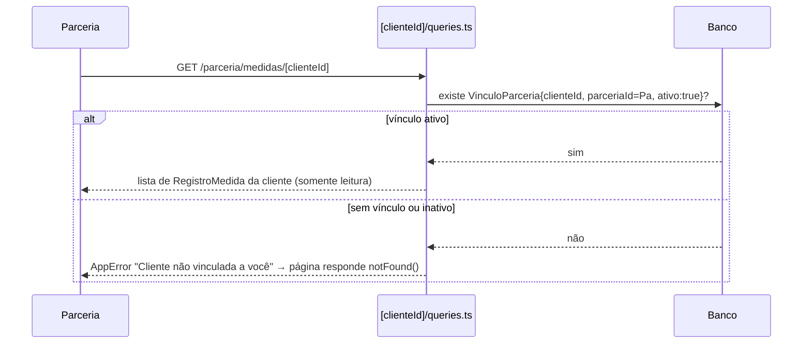

# Feature: Medidas

## Visão geral (sem jargão)

É a "fita métrica digital" da comunidade: a cliente registra periodicamente peso, altura e um conjunto de circunferências do corpo (cintura, braço, coxa, etc.), e o app desenha um gráfico mostrando a evolução ao longo do tempo. Uma parceria (nutricionista, personal trainer) vinculada àquela cliente pode acompanhar essas medidas — mas só enquanto o vínculo estiver ativo, e só em modo leitura.

## Estrutura de arquivos

| Arquivo | Papel |
| --- | --- |
| `src/app/cliente/medidas/page.tsx` | Tela principal: gráfico + histórico de registros da própria cliente |
| `src/app/cliente/medidas/campos.ts` | `CAMPOS_MEDIDA` — os 20 campos aceitos no formulário atual |
| `src/app/cliente/medidas/actions.ts` | `criarRegistroMedida`, `editarRegistroMedida`, `excluirRegistroMedida` |
| `src/app/cliente/medidas/queries.ts` | `listarMedidas` — histórico da cliente logada |
| `src/app/cliente/medidas/formulario-registro.tsx` | Form de criar/editar registro |
| `src/app/cliente/medidas/card-medida.tsx` | Card de um registro no histórico |
| `src/app/cliente/medidas/grafico-evolucao.tsx` | Gráfico de evolução (Recharts) |
| `src/app/parceria/medidas/page.tsx` + `queries.ts` | Lista de clientes vinculadas (parceria) |
| `src/app/parceria/medidas/[clienteId]/page.tsx` + `queries.ts` | Visualização somente-leitura das medidas de uma cliente |

## Models envolvidos

Ver [`docs/database.md`](../database.md#medidas--ver-docsfeaturesmedidasmd).

`RegistroMedida` — 20 campos ativos no formulário atual: `peso`, `altura`, 5 medidas de tronco sem lado (`ombro`, `peitoBusto`, `cintura`, `abdomen`, `quadril`) e 7 pares bilaterais direito/esquerdo (braço, antebraço, punho, coxa, joelho, panturrilha, tornozelo). Os campos legados `braco`/`coxa` (sem lado) continuam no schema e aparecem no histórico só como "registro anterior" quando presentes — não fazem mais parte do formulário de novo registro.

## Rotas e Server Actions

| Rota/Action | O que faz | Gate | Models |
| --- | --- | --- | --- |
| `criarRegistroMedida` | Cria um novo registro | `requererPapel(["CLIENTE"])` | `RegistroMedida` |
| `editarRegistroMedida` | Edita um registro, confirmando que pertence ao próprio cliente | `requererPapel(["CLIENTE"])` | `RegistroMedida` |
| `excluirRegistroMedida` | Apaga um registro, confirmando dono | `requererPapel(["CLIENTE"])` | `RegistroMedida` |
| `GET /parceria/medidas` | Lista clientes com vínculo ativo | Sessão autenticada (reaproveita `listarClientesVinculadas` de `parceria/planos/queries.ts`) | `VinculoParceria` |
| `GET /parceria/medidas/[clienteId]` | Vê medidas de uma cliente específica, só leitura | `requererPapel(["PARCERIA"])` + `VinculoParceria.ativo = true` para aquele par | `VinculoParceria`, `RegistroMedida`, `User` |

## Fluxo: registro de medidas

O formulário replica no client as mesmas faixas de validação usadas no servidor (`actions.ts`), mas a validação que de fato vale é sempre a do servidor — o client só evita round-trips desnecessários. Cada campo é independente e opcional: um registro pode preencher só peso e cintura, por exemplo, sem exigir o conjunto completo.

Para exibição no card/histórico, quando um "membro" (ex.: braço) tem os dois lados preenchidos, o valor mostrado é a **média** entre direito e esquerdo; se só um lado foi preenchido, usa-se esse valor; se nenhum lado foi preenchido mas existe o campo legado sem lado (só para `braco`/`coxa`), usa-se o legado. Esse cálculo é só de apresentação — não migra nem agrega nada no banco.

## Fluxo: visualização pela parceria

A tela é estritamente somente-leitura — não há nenhuma action de escrita disponível para a parceria sobre as medidas de uma cliente.

## Pegadinha: cor da legenda do gráfico (ativo/inativo)

O gráfico usa a legenda do Recharts para ligar/desligar cada linha de medida. O comportamento **antigo** (bug corrigido recentemente, commit `e7a2f2a`) colorria o texto da legenda com a própria cor `stroke` da linha — então linhas em tons claros da paleta (Peso, Ombro, Joelho, todas usando o token `--chart-1`) ficavam com o texto sempre "meio apagado" visualmente, e não dava para perceber se aquela linha estava ativa ou desligada no gráfico.

A correção (`grafico-evolucao.tsx`) para de deixar o Recharts aplicar `entry.color` ao texto e passa a controlar a aparência **só via CSS**, usando a classe `inactive` que o próprio Recharts já adiciona ao item de legenda desligado: `.recharts-legend-item.inactive .recharts-legend-item-text { opacity: 60%; text-decoration: line-through }`. Assim, o estado visual da legenda depende exclusivamente de "ativo ou inativo", nunca da cor da linha em si. Há um teste de regressão dedicado (`grafico-evolucao-cores.test.tsx`) cobrindo as 13 linhas do gráfico para essa exata pegadinha.

## Visibilidade pública via `Perfil.medidasPublicas`

Além do acesso por vínculo de parceria, existe uma **segunda via** de exposição de medidas: se `Perfil.medidasPublicas = true`, a última medida da cliente aparece na página pública `/perfil/[clienteId]`, visível a **qualquer** usuário autenticado ativo da comunidade — não só a parcerias vinculadas. É um mecanismo independente do `VinculoParceria`; ver [`docs/features/perfil.md`](./perfil.md#visibilidade-como-os-3-toggles--a-flag-por-foto-se-combinam).

## Pegadinhas e dívidas técnicas

- Todos os `queries.ts` deste contexto lançam `new Error("Sessão inválida")` **cru** (não `AppError`) quando não há sessão. Na prática isso é inofensivo porque o middleware já bloqueia usuários sem sessão antes de a request chegar aqui — mas é inconsistente com o padrão `AppError` usado em `actions.ts`, e vale corrigir por consistência.
- A spec do spec-kit (`specs/003-medidas-parcerias/data-model.md` e `contracts/actions.md`) está alinhada com o código atual — nenhuma divergência encontrada.
