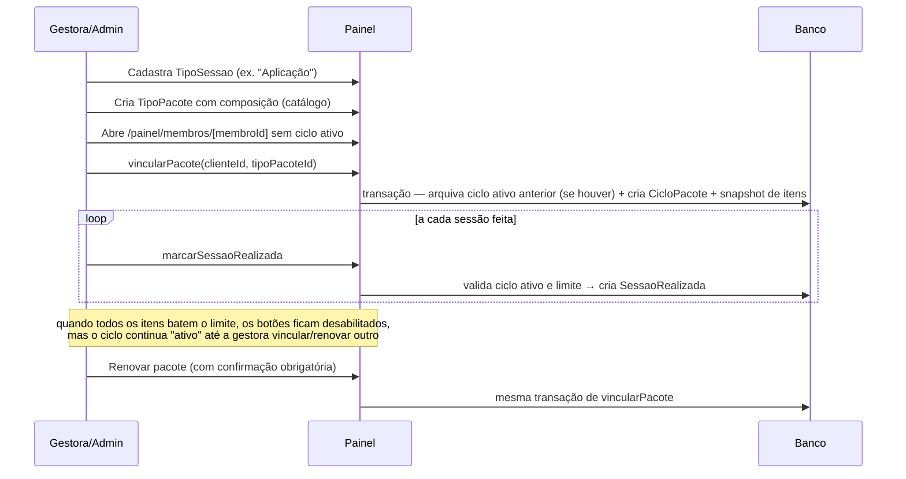

# Feature: Pacotes de sessões

## Visão geral (sem jargão)

Pense num cardápio de procedimentos (ex.: "Aplicação", "Radiofrequência") e em combos vendidos a partir desse cardápio (ex.: "Projeto Corpo dos Sonhos" = 10 Aplicações + 5 Radiofrequências). A gestora mantém esse cardápio e esses combos como um catálogo reutilizável. Quando uma cliente compra um combo, o sistema tira uma "foto" do catálogo naquele momento e grava como o contrato daquela cliente — mesmo que o catálogo mude depois, o que já foi vendido não muda retroativamente. A cada sessão que a cliente de fato realiza, a gestora marca no sistema, e o app mostra "quantas sessões de cada tipo já foram usadas / quantas tem direito".

## Estrutura de arquivos

| Arquivo | Papel |
| --- | --- |
| `src/app/painel/pacotes/page.tsx` | Tela do catálogo: lista tipos de sessão e tipos de pacote |
| `src/app/painel/pacotes/actions.ts` | CRUD do catálogo (`TipoSessao`, `TipoPacote`) |
| `src/app/painel/pacotes/queries.ts` | `listarTiposSessao`, `listarTiposPacote` |
| `src/app/painel/pacotes/formulario-criar-tipo-sessao.tsx` / `formulario-editar-tipo-sessao.tsx` | Form de nome simples |
| `src/app/painel/pacotes/formulario-criar-tipo-pacote.tsx` / `formulario-editar-tipo-pacote.tsx` | Form de nome + checklist de quantidade por tipo de sessão |
| `src/app/painel/pacotes/linha-tipo-sessao.tsx` / `linha-tipo-pacote.tsx` | Exibição, edição inline, excluir/reativar |
| `src/app/painel/membros/[membroId]/page.tsx` | Tela "Pacote de sessões" de uma cliente específica |
| `src/app/painel/membros/[membroId]/actions.ts` | `vincularPacote`, `marcarSessaoRealizada`, `desfazerSessaoRealizada` |
| `src/app/painel/membros/[membroId]/queries.ts` | `obterMembro`, `obterCicloAtivo`, `listarHistoricoCiclos` |
| `src/app/painel/membros/[membroId]/formulario-vincular-pacote.tsx` | Vincula/renova um pacote pra cliente |
| `src/app/painel/membros/[membroId]/botao-marcar-sessao.tsx` / `botao-desfazer-sessao.tsx` | Marcar/desfazer uma sessão realizada |

> A tela de **lista** de membros (`painel/membros/page.tsx`) — suspender/reativar conta, promover/revogar papel de Parceria ou Gestora — não é sobre pacotes; é gestão de conta e papel, documentada em [`docs/features/identidade-acesso.md`](./identidade-acesso.md#rotas-e-server-actions). Só a subrota `[membroId]` (a aba "Pacote de sessões" de uma cliente específica) pertence a esta feature.

## Models envolvidos

Ver [`docs/database.md`](../database.md#pacotes-de-sessões--ver-docsfeaturespacotesmd).

| Model | Papel no domínio |
| --- | --- |
| `TipoSessao` | Item do cardápio (reutilizável entre pacotes) |
| `TipoPacote` + `ItemTipoPacote` | Catálogo do combo: nome + quantidade padrão de cada tipo de sessão |
| `CicloPacote` | O contrato de fato com uma cliente — cópia própria de `nomePacote` |
| `ItemCicloPacote` | Cópia da composição no momento da contratação (`quantidadeContratada`) |
| `SessaoRealizada` | Cada sessão de fato realizada e marcada (`marcadoPorId` sempre uma gestora/admin) |

## Rotas e Server Actions

Todas as actions abaixo exigem `requererAcessoPainel()` (papéis `GESTORA`/`ADMIN`); as de gestão de gestoras exigem adicionalmente ser `ADMIN`.

As leituras também têm gate próprio: `src/app/painel/pacotes/page.tsx` e `src/app/painel/membros/[membroId]/page.tsx` chamam `requererAcessoPainelOuRedirecionar()` no início, assim como `listarTiposSessao`, `listarTiposPacote`, `obterMembro`, `obterCicloAtivo` e `listarHistoricoCiclos`. Conta não `ATIVO` ou sem papel de painel é redirecionada para `/`. Ver [`docs/architecture.md`](../architecture.md#gates-de-acesso).

| Action | O que faz | Models |
| --- | --- | --- |
| `criarTipoSessao` / `editarTipoSessao` | Cria/edita item do cardápio; nome duplicado vira erro amigável | `TipoSessao` |
| `excluirTipoSessao` | Se em uso em algum pacote/ciclo/sessão, **arquiva** (`ativo:false`); senão apaga de verdade | `TipoSessao` |
| `reativarTipoSessao` | Volta a `ativo:true` | `TipoSessao` |
| `criarTipoPacote` | Valida itens (≥1, sem duplicado, tipos de sessão existentes), cria o combo | `TipoPacote`, `ItemTipoPacote` |
| `editarTipoPacote` | Substitui toda a composição numa transação — **não** afeta ciclos já vendidos | `TipoPacote`, `ItemTipoPacote` |
| `excluirTipoPacote` | Em uso → arquiva; senão apaga | `TipoPacote` |
| `reativarTipoPacote` | Volta a `ativo:true` | `TipoPacote` |
| `vincularPacote(clienteId, tipoPacoteId)` | Arquiva o ciclo ativo (se houver) e cria um novo, copiando os itens do catálogo | `CicloPacote`, `ItemCicloPacote` |
| `marcarSessaoRealizada(cicloPacoteId, tipoSessaoId)` | Valida ciclo ativo + limite não estourado, cria a marcação | `SessaoRealizada` |
| `desfazerSessaoRealizada(id)` | Apaga a marcação — hard delete, sem restrição de qual sessão | `SessaoRealizada` |

## Fluxo completo

O contador "X/Y" mostrado na tela **nunca é um campo salvo** — é sempre `count(SessaoRealizada)` calculado na hora, o que elimina o risco de um contador dessincronizar do histórico real.

## Padrão "um ativo por vez" aplicado a `CicloPacote`

Igual ao `Desafio.ativo` (ver [`docs/architecture.md`](../architecture.md#padrão-um-ativo-por-vez)), a exclusividade é garantida **na aplicação**, dentro da mesma transação Prisma de `vincularPacote` — não existe constraint de banco impedindo dois ciclos ativos. A regra é **por cliente** (`where: { clienteId, ativo: true }`), não por tipo de pacote: uma cliente só pode ter um `CicloPacote` ativo de cada vez, independente de qual combo for.

Esgotar as sessões contratadas (bater o limite em todos os itens) é só um estado **visual** — os botões de marcar ficam desabilitados, mas nada arquiva o ciclo automaticamente. Só a próxima vinculação/renovação arquiva o ciclo atual.

## Pegadinhas e dívidas técnicas

- **`vincularPacote` não valida que o `TipoPacote` tenha itens** antes de criar o ciclo. Como `criarTipoPacote` já exige pelo menos 1 item, isso não deveria acontecer na prática, mas não há uma segunda barreira caso o catálogo fique vazio por outro caminho.
- **`obterCicloAtivo` faz uma consulta de contagem por item** (N+1 leve) — sem impacto real hoje porque o catálogo é pequeno, mas cresce proporcionalmente ao número de tipos de sessão distintos no pacote.
- **`marcarSessaoRealizada` aceita uma `data` opcional sem validar o formato** antes de `new Date(data)`. Hoje nenhum caller passa esse parâmetro, então não é explorável na prática — mas é uma porta aberta para salvar `Invalid Date` silenciosamente se um novo caller passar uma string inválida.
- A spec do spec-kit (`specs/001-pacotes-sessoes/data-model.md`) está alinhada com o código atual — nenhuma divergência encontrada.
