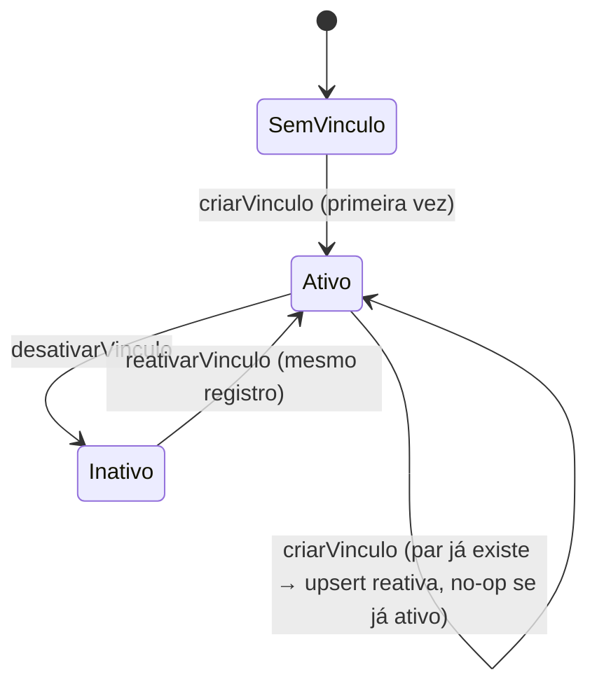
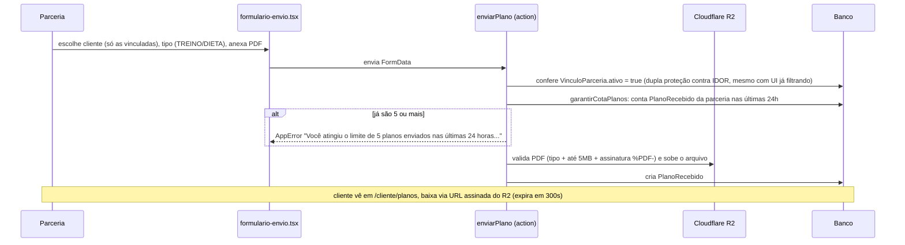

# Feature: Parcerias

## Visão geral (sem jargão)

Uma "parceria" é um profissional externo à administração — uma nutricionista, um personal trainer — que atende clientes da comunidade fora da plataforma, mas usa o app para duas coisas: enviar planos personalizados (treino ou dieta, em PDF) e acompanhar as medidas de quem ela atende (ver [`docs/features/medidas.md`](./medidas.md)). Só a administração (gestora/admin) pode criar essa ponte entre uma cliente e uma parceria — é o que chamamos de **vínculo**. Sem vínculo ativo, a parceria não enxerga nada daquela cliente.

## Estrutura de arquivos

| Arquivo | Papel |
| --- | --- |
| `src/app/parceria/perfil/page.tsx`, `actions.ts`, `queries.ts`, `formulario-perfil-parceria.tsx` | Parceria edita o próprio `PerfilParceria` (especialidade, bio, foto) |
| `src/app/parceria/planos/page.tsx`, `actions.ts`, `queries.ts`, `formulario-envio.tsx` | Parceria envia um `PlanoRecebido` (PDF) a uma cliente vinculada |
| `src/app/painel/vinculos/page.tsx`, `actions.ts`, `queries.ts`, `formulario-criar-vinculo.tsx`, `botao-reativar-vinculo.tsx` | Gestora cria/desativa/reativa `VinculoParceria` |
| `src/app/cliente/parcerias/page.tsx`, `queries.ts` | Cliente vê as parcerias vinculadas a ela |
| `src/app/cliente/planos/page.tsx`, `queries.ts` | Cliente vê/baixa os planos recebidos |
| `src/lib/storage/parcerias.ts` | Upload/validação da foto de perfil da parceria (JPEG/PNG/WebP, 5MB) |
| `src/lib/storage/planos.ts` | Upload/validação do PDF do plano (tipo declarado `application/pdf`, até 5MB e assinatura binária `%PDF-` nos primeiros bytes) |
| `src/lib/storage/cotas.ts` | `garantirCotaPlanos` — cota de 5 planos enviados por parceria a cada 24 horas (ver [Cota de envio de planos](#cota-de-envio-de-planos)) |

## Models envolvidos

Ver [`docs/database.md`](../database.md#parcerias--ver-docsfeaturesparceriasmd).

- **`VinculoParceria`** — liga um `User` cliente a um `User` parceria; `ativo` controla se a ligação está em vigor; `@@unique([clienteId, parceriaId])` garante um único vínculo por par (reativar reusa o mesmo registro, nunca duplica).
- **`PlanoRecebido`** — um envio de arquivo (TREINO ou DIETA) de uma parceria para uma cliente. Sem edição, só novos envios.
- **`PerfilParceria`** — perfil próprio da parceria (especialidade, bio, foto), separado do `Perfil` de cliente.

## Rotas e Server Actions

| Action | O que faz | Gate | Models |
| --- | --- | --- | --- |
| `atualizarPerfilParceria` | Upsert de `PerfilParceria`; troca de foto sobe a nova antes de apagar a antiga | `requererPapel(["PARCERIA"])` | `PerfilParceria` |
| `enviarPlano` | Valida cliente + tipo + arquivo, confere vínculo ativo, confere a cota de 24h da parceria (`garantirCotaPlanos`), sobe o PDF, cria `PlanoRecebido` | `requererPapel(["PARCERIA"])` | `VinculoParceria`, `PlanoRecebido` |
| `criarVinculo` | Cria o vínculo, ou reativa se já existir (mesmo par) | `requererAcessoPainel()` (GESTORA/ADMIN) | `VinculoParceria` |
| `desativarVinculo` | `ativo: false` | `requererAcessoPainel()` | `VinculoParceria` |
| `reativarVinculo` | `ativo: true` | `requererAcessoPainel()` | `VinculoParceria` |

## Fluxo: criar e reativar vínculo

`criarVinculo` faz um `upsert` na chave composta `clienteId_parceriaId`: se o vínculo já existir (mesmo desativado), ele é reativado em vez de duplicado; se não existir, é criado com `ativo: true` e `criadoPorId` apontando para a gestora que criou. **Nunca há exclusão real de um vínculo** — desativar/reativar são sempre a mesma flag `ativo` sendo ligada/desligada, o que preserva o histórico de tudo que dependeu daquele vínculo (planos enviados no passado continuam existindo e visíveis à cliente mesmo depois de desativado).

## Fluxo: envio de plano

### Validação do PDF

**Em linguagem simples:** o sistema não confia só no "rótulo" que o navegador põe no arquivo; ele abre o arquivo e confere se começa como todo PDF começa.

`uploadPlano` (`src/lib/storage/planos.ts`) aplica três checagens, nesta ordem, todas lançando `AppError` (a mensagem chega à tela via `executarAction`):

| Checagem | Onde | Mensagem de erro |
| --- | --- | --- |
| `arquivo.type === "application/pdf"` (tipo declarado pelo navegador) | `validarArquivoPdf` | "Formato inválido. Envie um arquivo PDF." |
| `arquivo.size <= 5MB` (`TAMANHO_MAXIMO_BYTES`) | `validarArquivoPdf` | "Arquivo muito grande. Tamanho máximo: 5MB." |
| Os 5 primeiros bytes são `%PDF-` (`ASSINATURA_PDF`, lidos como `latin1`) | `uploadPlano`, depois de ler o `Buffer` | "Arquivo não é um PDF válido." |

É o equivalente, para PDF, da leitura de magic bytes que `comprimir-imagem.ts` faz para imagens (ver [`docs/architecture.md`](../architecture.md#storage-r2)).

O limite de 5MB não é mais o mesmo número do comentário de `next.config.ts` sobre `bodySizeLimit: "12mb"` das Server Actions: o `bodySizeLimit` continua em 12MB, agora com folga maior (7MB) sobre o maior upload validado, cobrindo com sobra o overhead do multipart/form-data (boundaries e headers). O comentário em `next.config.ts` já cita os 5MB de `TAMANHO_MAXIMO_BYTES`.

### Cota de envio de planos

**Em linguagem simples:** cada parceria pode enviar até 5 planos por dia (numa janela móvel de 24 horas, não por dia do calendário). Ao passar disso, o formulário mostra a mensagem do limite e ela tenta de novo mais tarde.

`garantirCotaPlanos(parceriaId)` (`src/lib/storage/cotas.ts`) conta os `PlanoRecebido` com aquele `parceriaId` e `enviadoEm >= agora - 24h` (`JANELA_COTA_MS`). Se o total já for `>= LIMITE_PLANOS_POR_JANELA` (5), lança `AppError("Você atingiu o limite de 5 planos enviados nas últimas 24 horas. Tente novamente mais tarde.")`. Detalhes:

- A cota é **por parceria**, somando os envios para todas as clientes (não é por par cliente/parceria).
- Em `enviarPlano` ela roda **depois** das validações de campos e da checagem de vínculo, e **antes** de `uploadPlano` — quando a cota estoura, nada é enviado ao R2.
- `formulario-envio.tsx` exibe `error.message` da action (a mensagem da cota ou da validação do PDF); só cai no texto genérico "Confira os campos e o arquivo (PDF, até 5MB)" se o erro vier sem mensagem.
- Visão geral de todas as cotas do projeto: [`docs/architecture.md`](../architecture.md#cotas-de-upload-por-usuária).

## Perfil da parceria (`PerfilParceria`)

Campos editáveis (todos opcionais): `especialidade`, `bio`, `fotoChave`. Diferente do perfil de cliente, **não existe uma página pública equivalente a `/perfil/[clienteId]`** para parcerias — a única forma de uma cliente ver o `PerfilParceria` de alguém é através da relação de vínculo ativo, em `/cliente/parcerias`. Isso torna a exposição do perfil da parceria mais restrita, por natureza, que a do perfil de cliente.

A foto do `PerfilParceria` é assinada com `gerarUrlAssinadaCacheavel` (reexportada por `src/lib/storage/parcerias.ts`) tanto em `/parceria/perfil` (`src/app/parceria/perfil/page.tsx`) quanto na lista de parcerias da cliente (`listarParceriasVinculadas`, `src/app/cliente/parcerias/queries.ts`): a mesma URL durante a hora cheia, válida por até 2h. O PDF de plano, por outro lado, continua com a URL de 5 minutos (`gerarUrlAssinada`). Ver [`docs/architecture.md`](../architecture.md#dois-tipos-de-url-assinada-efêmera-vs-cacheável).

## Pegadinhas e dívidas técnicas

- **Arquivo de foto pode ficar órfão no R2**: em `atualizarPerfilParceria`, se o upload da nova foto falhar antes do `upsert` do `PerfilParceria` chegar a rodar, o arquivo novo já pode ter sido gravado no R2 sem nunca ser referenciado por nenhum registro — não há limpeza automática desse órfão.
- Todos os `queries.ts` deste contexto (`parceria/perfil`, `parceria/planos`, `cliente/parcerias`, `cliente/planos`) lançam `new Error("Sessão inválida")` **cru** (não `AppError`) — mesmo padrão inconsistente já visto em [`docs/features/medidas.md`](./medidas.md#pegadinhas-e-dívidas-técnicas). Inofensivo hoje porque o middleware bloqueia sessões ausentes antes, mas destoa do padrão do resto do projeto.
- Não existe uma spec de spec-kit dedicada a "parcerias" isoladamente — o vínculo aparece documentado dentro de `specs/003-medidas-parcerias/data-model.md` como pré-condição reaproveitada, não como escopo próprio da feature.
