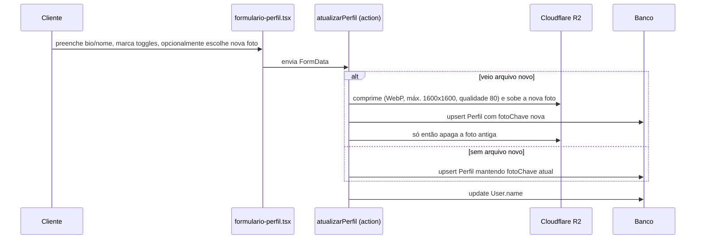

# Feature: Perfil

## Visão geral (sem jargão)

É o cartão de visita de cada cliente dentro da comunidade: uma foto, uma bio curta e uma galeria de fotos de "evolução" (antes/depois do corpo ao longo do tempo). Cada cliente decide, com três interruptores separados, o que dessas informações fica visível para as outras pessoas da comunidade: a bio, os emblemas conquistados nos desafios, e a última medida registrada. Além disso, cada foto de evolução tem seu próprio interruptor de "pública ou privada" — dá pra deixar o perfil geral fechado e mesmo assim mostrar uma foto específica, ou vice-versa.

Existem duas telas de edição (uma pra editar o próprio perfil, outra só pra gerenciar as fotos de evolução) e uma tela de visualização pública, que qualquer pessoa logada da comunidade pode acessar apontando o id de outra cliente na URL.

## Estrutura de arquivos

| Arquivo | Papel |
| --- | --- |
| `src/app/cliente/perfil/page.tsx` | Página de edição do próprio perfil (server component) |
| `src/app/cliente/perfil/actions.ts` | `atualizarPerfil` — upsert de bio, nome, foto e os 3 toggles |
| `src/app/cliente/perfil/formulario-perfil.tsx` | Formulário client: bio, nome, upload de foto, checkboxes de visibilidade |
| `src/app/cliente/perfil/queries.ts` | `obterPerfilProprio` |
| `src/app/cliente/fotos/page.tsx` | "Minhas fotos de evolução" — upload + galeria |
| `src/app/cliente/fotos/actions.ts` | `enviarFoto`, `alternarVisibilidadeFoto`, `excluirFoto` |
| `src/app/cliente/fotos/formulario-upload.tsx` | Formulário client de upload de nova foto |
| `src/app/cliente/fotos/item-foto.tsx` | Card de cada foto (toggle público/privado + excluir com confirmação) |
| `src/app/cliente/fotos/queries.ts` | `listarFotos` — fotos do usuário logado com URL assinada |
| `src/app/perfil/[clienteId]/page.tsx` | Página pública de perfil de qualquer usuário |
| `src/app/perfil/[clienteId]/queries.ts` | `obterPerfilPublico` — monta o payload condicional por toggle |
| `src/lib/storage/perfil.ts` | Upload/validação/delete da foto de perfil no R2 |
| `src/lib/storage/fotos.ts` | Upload/validação/delete das fotos de evolução no R2 |
| `src/lib/storage/comprimir-imagem.ts` | Validação real de formato (magic bytes) + resize/recompressão pra WebP |
| `src/lib/iniciais.ts` | Gera iniciais a partir do nome (fallback de avatar sem foto) |

## Models envolvidos

Ver [`docs/database.md`](../database.md#perfil--ver-docsfeaturesperfilmd) para os campos completos.

- **`Perfil`** — 1:1 com `User`. Bio, `fotoChave`, e os três toggles `bioPublica`, `emblemasPublicos`, `medidasPublicas`.
- **`FotoEvolucao`** — N:1 com `User` (`clienteId`). Cada foto tem seu próprio `publica: Boolean`.

## Rotas e Server Actions

| Rota/Action | O que faz | Gate de acesso | Models |
| --- | --- | --- | --- |
| `GET /cliente/perfil` | Formulário de edição do próprio perfil | Checagem manual na própria page (`podeAcessarAreaCliente` + `redirect("/")`) — **não** usa `requererPapel` | `Perfil` |
| `atualizarPerfil` | Upsert de `Perfil` (bio, toggles, foto) + `User.name` | `requererPapel(["CLIENTE"])` | `Perfil`, `User` |
| `GET /cliente/fotos` | Upload + galeria de fotos próprias | Mesmo padrão manual de gate da page de perfil | `FotoEvolucao` |
| `enviarFoto` | Upload de nova foto (privada por padrão) | `requererPapel(["CLIENTE"])` | `FotoEvolucao` |
| `alternarVisibilidadeFoto` | Inverte `FotoEvolucao.publica` | `requererPapel(["CLIENTE"])` + confere dono | `FotoEvolucao` |
| `excluirFoto` | Apaga o arquivo no R2 **e** a linha no banco | `requererPapel(["CLIENTE"])` + confere dono | `FotoEvolucao` |
| `GET /perfil/[clienteId]` | Perfil público de qualquer usuário | Só `auth()` — qualquer sessão autenticada, sem checar papel ou vínculo | `User`, `Perfil`, `Conquista`, `FotoEvolucao`, `Post`, `RegistroMedida` |

## Fluxo: editar perfil próprio

A ordem "sobe a nova antes de apagar a antiga" é deliberada: se o upload falhar, a foto antiga continua servindo, nunca fica um perfil sem foto por causa de um erro de rede.

## Fluxo: fotos de evolução

Upload segue a mesma validação/compressão da foto de perfil (`comprimir-imagem.ts`, que decide o formato lendo os bytes reais do arquivo, não confiando no `Content-Type` enviado pelo navegador — esse é spoofável). Toda foto nasce **privada** (`publica: false` por default no schema); a cliente decide individualmente, foto a foto, quais tornar públicas.

Exclusão é real, não é uma flag: `excluirFoto` chama `deletarObjeto` no R2 (removendo o arquivo do bucket) **antes** de apagar a linha no Postgres — coerente com a promessa do termo de consentimento em `bem-vinda/page.tsx` ("a exclusão remove o arquivo de verdade do armazenamento").

## Visibilidade: como os 3 toggles + a flag por-foto se combinam

| Controle | Escopo | Efeito em `/perfil/[clienteId]` quando desligado |
| --- | --- | --- |
| `Perfil.bioPublica` | Geral (todo o perfil) | `bio` retorna `null` mesmo que exista |
| `Perfil.emblemasPublicos` | Geral | Lista de emblemas/conquistas retorna vazia (a query nem roda) |
| `Perfil.medidasPublicas` | Geral | `ultimaMedida` retorna `null` (a query nem roda) |
| `FotoEvolucao.publica` | Por foto individual | Aquela foto específica some da galeria pública |

Importante: nenhum desses controles depende de `VinculoParceria`. É visibilidade **pública geral** — qualquer usuário autenticado da comunidade vê o que estiver marcado como público, não é uma permissão específica de parceria. O acesso de uma parceria às medidas de uma cliente vinculada é um mecanismo **separado**, via `VinculoParceria.ativo`, coberto em [`docs/features/medidas.md`](./medidas.md) — não pelos toggles do `Perfil`.

Todos os posts do autor aparecem na página pública, independente de qualquer visibilidade própria de post no feed (não há filtro de "post privado").

## Fallback de avatar

Se não há `Perfil.fotoChave`, a página pública usa `User.image` (a foto de perfil do Google) como fallback. Isso mistura dois modelos de exposição de imagem: a foto própria vira uma signed URL temporária do R2 (expira em 5 minutos), enquanto a foto do Google é uma URL pública direta, servida sem passar pelo storage do projeto. Se nenhuma das duas existir, `iniciais.ts` gera as iniciais do nome para um avatar textual.

## Pegadinhas e dívidas técnicas

- **Gate de página duplicado e manual**: `cliente/perfil/page.tsx` e `cliente/fotos/page.tsx` fazem `if (!session?.user || !podeAcessarAreaCliente(...)) redirect("/")` cada um na própria página, em vez de um helper único reaproveitável — existe `requererPapel`/`requererSessao` para actions, mas nada equivalente pronto para page components. Duplicação com risco de divergência se a regra mudar num lugar e não no outro.
- **Sem paginação em `obterPerfilPublico`**: posts, fotos e conquistas são listados por completo, e cada foto/post gera uma chamada separada de assinatura de URL ao R2 (via `Promise.all`, sem cache) — cresce sem limite conforme o histórico da cliente aumenta.
- **Validação de arquivo é "dupla" por design**: o `Content-Type` declarado é checado primeiro (rápido, mas confia no client), e a validação que realmente importa — leitura de magic bytes — acontece em `comprimir-imagem.ts`. Isso é uma decisão de arquitetura documentada no próprio código, não um bug, mas vale ter em mente ao alterar a validação de upload em qualquer lugar do projeto (o mesmo padrão vale para os demais uploads de imagem: `storage/posts.ts`, `storage/parcerias.ts` e os storages de comprovante e jornada).
