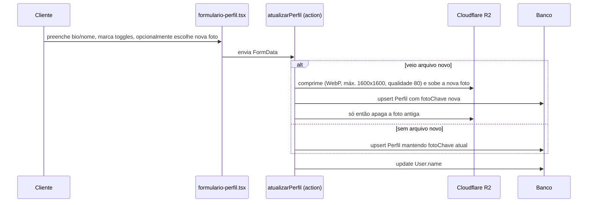
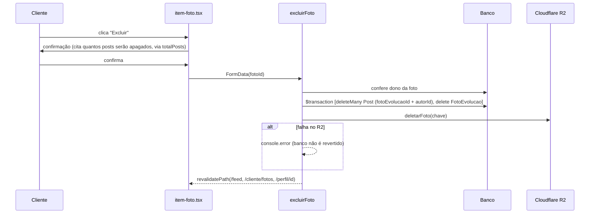

# Feature: Perfil

## Visão geral (sem jargão)

É o cartão de visita de cada cliente dentro da comunidade: uma foto, uma bio curta e uma galeria de fotos de "evolução" (antes/depois do corpo ao longo do tempo). Cada cliente decide, com três interruptores separados, o que dessas informações fica visível para as outras pessoas da comunidade: a bio, os emblemas conquistados nos desafios, e a última medida registrada. Além disso, cada foto de evolução tem seu próprio interruptor de "pública ou privada" — dá pra deixar o perfil geral fechado e mesmo assim mostrar uma foto específica, ou vice-versa.

Existem duas telas de edição (uma pra editar o próprio perfil, outra só pra gerenciar as fotos de evolução) e uma tela de visualização pública, que qualquer pessoa logada da comunidade pode acessar apontando o id de outra cliente na URL.

## Estrutura de arquivos

| Arquivo | Papel |
| --- | --- |
| `src/app/cliente/perfil/page.tsx` | Página de edição do próprio perfil (server component) |
| `src/app/cliente/perfil/actions.ts` | `atualizarPerfil` — upsert de bio, nome, foto e os 3 toggles |
| `src/app/cliente/perfil/formulario-perfil.tsx` | Formulário client: bio, nome, upload de foto, checkboxes de visibilidade |
| `src/app/cliente/perfil/queries.ts` | `obterPerfilProprio` |
| `src/app/cliente/fotos/page.tsx` | "Minhas fotos de evolução" — upload + galeria |
| `src/app/cliente/fotos/actions.ts` | `enviarFoto`, `alternarVisibilidadeFoto`, `excluirFoto` |
| `src/app/cliente/fotos/formulario-upload.tsx` | Formulário client de upload de nova foto (texto explica que a foto nasce privada e pode ser tornada pública no perfil ou compartilhada em post); em caso de erro exibe `error.message` da action (ex.: limite de fotos, formato/tamanho) e só cai no texto genérico se o erro vier sem mensagem |
| `src/app/cliente/fotos/item-foto.tsx` | Card de cada foto (imagem via `ImagemSensivel`; toggle público/privado + excluir, com confirmação que informa quantos posts serão apagados) |
| `src/app/cliente/fotos/queries.ts` | `listarFotos` — fotos do usuário logado com URL assinada e `totalPosts` (quantos posts usam a foto) |
| `src/app/perfil/[clienteId]/page.tsx` | Página pública de perfil de qualquer usuário (fotos de evolução e imagens de post com `fotoEvolucaoId` via `ImagemSensivel`) |
| `src/app/perfil/[clienteId]/queries.ts` | `obterPerfilPublico` — monta o payload condicional por toggle; cada post traz `fotoEvolucaoId` |
| `src/components/imagem-sensivel.tsx` | Wrapper de `next/image` sempre `unoptimized`, usado para fotos corporais (ver [`docs/architecture.md`](../architecture.md#exibindo-imagens-sensíveis-imagemsensivel)) |
| `src/lib/storage/perfil.ts` | Upload/validação/delete da foto de perfil no R2 |
| `src/lib/storage/fotos.ts` | Upload/validação/delete das fotos de evolução no R2 |
| `src/lib/storage/cotas.ts` | `garantirCotaFotosEvolucao` — limite de 100 fotos de evolução por cliente (ver [Limite de fotos de evolução](#limite-de-fotos-de-evolução)) |
| `src/lib/storage/comprimir-imagem.ts` | Validação real de formato (magic bytes) + resize/recompressão pra WebP |
| `src/lib/iniciais.ts` | Gera iniciais a partir do nome (fallback de avatar sem foto) |

## Models envolvidos

Ver [`docs/database.md`](../database.md#perfil--ver-docsfeaturesperfilmd) para os campos completos.

- **`Perfil`** — 1:1 com `User`. Bio, `fotoChave`, e os três toggles `bioPublica`, `emblemasPublicos`, `medidasPublicas`.
- **`FotoEvolucao`** — N:1 com `User` (`clienteId`). Cada foto tem seu próprio `publica: Boolean`.

## Rotas e Server Actions

| Rota/Action | O que faz | Gate de acesso | Models |
| --- | --- | --- | --- |
| `GET /cliente/perfil` | Formulário de edição do próprio perfil | Checagem manual na própria page (`podeAcessarAreaCliente` + `redirect("/")`) — **não** usa `requererPapel` | `Perfil` |
| `atualizarPerfil` | Upsert de `Perfil` (bio, toggles, foto) + `User.name` | `requererPapel(["CLIENTE"])` | `Perfil`, `User` |
| `GET /cliente/fotos` | Upload + galeria de fotos próprias | Mesmo padrão manual de gate da page de perfil | `FotoEvolucao` |
| `enviarFoto` | Confere o limite de 100 fotos da cliente (`garantirCotaFotosEvolucao`) e só então faz o upload de nova foto (privada por padrão) | `requererPapel(["CLIENTE"])` | `FotoEvolucao` |
| `alternarVisibilidadeFoto` | Inverte `FotoEvolucao.publica`; ao tornar **privada**, apaga na mesma `$transaction` os posts que usam a foto. Revalida `/feed`, `/cliente/fotos` e `/perfil/[id]` | `requererPapel(["CLIENTE"])` + confere dono | `FotoEvolucao`, `Post` |
| `excluirFoto` | Apaga posts que usam a foto + a linha da foto numa `$transaction`, e só depois o arquivo no R2. Revalida `/feed`, `/cliente/fotos` e `/perfil/[id]` | `requererPapel(["CLIENTE"])` + confere dono | `FotoEvolucao`, `Post` |
| `GET /perfil/[clienteId]` | Perfil público de qualquer usuário | Só `auth()` — qualquer sessão autenticada, sem checar papel ou vínculo | `User`, `Perfil`, `Conquista`, `FotoEvolucao`, `Post`, `RegistroMedida` |

## Fluxo: editar perfil próprio

A ordem "sobe a nova antes de apagar a antiga" é deliberada: se o upload falhar, a foto antiga continua servindo, nunca fica um perfil sem foto por causa de um erro de rede.

## Fluxo: fotos de evolução

Upload segue a mesma validação/compressão da foto de perfil (`comprimir-imagem.ts`, que decide o formato lendo os bytes reais do arquivo, não confiando no `Content-Type` enviado pelo navegador — esse é spoofável). Toda foto nasce **privada** (`publica: false` por default no schema); a cliente decide individualmente, foto a foto, quais tornar públicas.

Uma foto de evolução pública pode ser anexada a um post do feed (ver [`docs/features/feed.md`](./feed.md#regra-só-foto-de-evolução-pública-vai-para-o-feed)). Por isso, **tornar privada** ou **excluir** uma foto também tira do ar os posts que a usam — pense na foto como a "dona" do post: se ela sai de cena, o post sai junto.

| Ação | Banco (numa `$transaction`) | R2 | Revalida |
| --- | --- | --- | --- |
| Tornar pública | `update publica = true` | — | `/feed`, `/cliente/fotos`, `/perfil/[id]` |
| Tornar privada | `post.deleteMany({ fotoEvolucaoId, autorId })` + `update publica = false` | Nada é apagado (a foto continua na galeria privada) | idem |
| Excluir | `post.deleteMany({ fotoEvolucaoId, autorId })` + `fotoEvolucao.delete` | `deletarFoto(chave)` **depois** do commit | idem |

O `autorId` do `deleteMany` é sempre o `session.user.id` da cliente logada (a mesma que `obterFotoDoUsuario` confirmou ser dona da foto), então a transação só apaga posts da própria cliente.

`Like` e `Comentario` dos posts apagados saem por `onDelete: Cascade`. O apagamento explícito é necessário porque a FK `Post.fotoEvolucaoId` é `ON DELETE SET NULL` — sem ele, o post sobreviveria com `imagemChave` apontando para a mesma foto (ver [`docs/database.md`](../database.md#ondelete-e-cascatas)).

A exclusão continua real, não é uma flag: o arquivo é removido do bucket — coerente com a promessa do termo de consentimento em `bem-vinda/page.tsx` ("a exclusão remove o arquivo de verdade do armazenamento"). A ordem é **banco primeiro, R2 depois**: se o R2 falhar, o erro é só logado (`console.error`) e a ação conclui com sucesso para a cliente; o resultado possível é um objeto órfão no bucket, preferido a um registro apontando para arquivo inexistente.

**Confirmação na UI (`item-foto.tsx`)**: `listarFotos` devolve `totalPosts` (`_count.posts`), e o card usa `BotaoComConfirmacao` com mensagens no singular/plural:

| Situação | Comportamento |
| --- | --- |
| Excluir, `totalPosts = 0` | "Excluir essa foto de evolução? Essa ação não pode ser desfeita." |
| Excluir, `totalPosts > 0` | "Esta foto está em N post(s) no feed, que também será(ão) apagado(s). Deseja excluir?" |
| Tornar privada, `totalPosts > 0` | Botão vira `BotaoComConfirmacao`: "Esta foto está em N post(s) no feed. Ao torná-la privada, esse(s) post(s) será(ão) apagado(s). Deseja continuar?" |
| Tornar privada sem posts / tornar pública | Botão simples, sem confirmação |

### Limite de fotos de evolução

**Em linguagem simples:** cada cliente guarda no máximo 100 fotos de evolução. É um total, não um limite por dia: quando chega a 100, ela precisa excluir fotos antigas para enviar novas.

`garantirCotaFotosEvolucao(clienteId)` (`src/lib/storage/cotas.ts`) conta todas as `FotoEvolucao` da cliente (públicas e privadas). Se o total já for `>= LIMITE_FOTOS_EVOLUCAO_POR_CLIENTE` (100), lança `AppError("Você atingiu o limite de 100 fotos. Exclua fotos antigas para enviar novas.")`. Em `enviarFoto` a checagem roda depois de confirmar que veio um arquivo e **antes** de `uploadFoto`, então, com o limite atingido, nada é enviado ao R2. Excluir uma foto (`excluirFoto`) libera a vaga imediatamente; tornar privada não libera, porque a foto continua existindo. Visão geral de todas as cotas: [`docs/architecture.md`](../architecture.md#cotas-de-upload-por-usuária).

## Visibilidade: como os 3 toggles + a flag por-foto se combinam

| Controle | Escopo | Efeito em `/perfil/[clienteId]` quando desligado |
| --- | --- | --- |
| `Perfil.bioPublica` | Geral (todo o perfil) | `bio` retorna `null` mesmo que exista |
| `Perfil.emblemasPublicos` | Geral | Lista de emblemas/conquistas retorna vazia (a query nem roda) |
| `Perfil.medidasPublicas` | Geral | `ultimaMedida` retorna `null` (a query nem roda) |
| `FotoEvolucao.publica` | Por foto individual | Aquela foto específica some da galeria pública |

Importante: nenhum desses controles depende de `VinculoParceria`. É visibilidade **pública geral** — qualquer usuário autenticado da comunidade vê o que estiver marcado como público, não é uma permissão específica de parceria. O acesso de uma parceria às medidas de uma cliente vinculada é um mecanismo **separado**, via `VinculoParceria.ativo`, coberto em [`docs/features/medidas.md`](./medidas.md) — não pelos toggles do `Perfil`.

Todos os posts do autor aparecem na página pública, independente de qualquer visibilidade própria de post no feed (não há filtro de "post privado"). Como um post só pode carregar foto de evolução pública — e é apagado quando ela deixa de ser — nenhuma foto privada aparece por meio de post. Posts com `fotoEvolucaoId` renderizam a imagem com `ImagemSensivel` e URL assinada de 5 minutos (`gerarUrlAssinada`); posts com upload próprio usam `next/image` comum e URL cacheável (`gerarUrlAssinadaCacheavel`, estável durante a hora cheia). A decisão é feita por post em `obterPerfilPublico`, olhando `post.fotoEvolucaoId`.

## Fallback de avatar

Se não há `Perfil.fotoChave`, a página pública usa `User.image` (a foto de perfil do Google) como fallback. Isso mistura dois modelos de exposição de imagem: a foto própria vira uma signed URL do R2 do tipo cacheável (`gerarUrlAssinadaCacheavel` reexportada por `src/lib/storage/perfil.ts`: a mesma URL durante a hora cheia, válida por até 2h; ver [`docs/architecture.md`](../architecture.md#dois-tipos-de-url-assinada-efêmera-vs-cacheável)), enquanto a foto do Google é uma URL pública direta, servida sem passar pelo storage do projeto. Se nenhuma das duas existir, `iniciais.ts` gera as iniciais do nome para um avatar textual.

## Pegadinhas e dívidas técnicas

- **Gate de página duplicado e manual**: `cliente/perfil/page.tsx` e `cliente/fotos/page.tsx` fazem `if (!session?.user || !podeAcessarAreaCliente(...)) redirect("/")` cada um na própria página, em vez de um helper único reaproveitável — existe `requererPapel`/`requererSessao` para actions, mas nada equivalente pronto para page components. Duplicação com risco de divergência se a regra mudar num lugar e não no outro.
- **Sem paginação em `obterPerfilPublico`**: posts, fotos e conquistas são listados por completo, e cada foto/post gera uma chamada separada de assinatura de URL (via `Promise.all`) — cresce sem limite conforme o histórico da cliente aumenta. A URL cacheável dos posts com upload próprio e do avatar reduz o re-download das imagens pelo navegador, mas a assinatura continua sendo calculada a cada render e as fotos de evolução seguem com URL de 5 minutos.
- **Validação de arquivo é "dupla" por design**: o `Content-Type` declarado é checado primeiro (rápido, mas confia no client), e a validação que realmente importa — leitura de magic bytes — acontece em `comprimir-imagem.ts`. Isso é uma decisão de arquitetura documentada no próprio código, não um bug, mas vale ter em mente ao alterar a validação de upload em qualquer lugar do projeto (o mesmo padrão vale para os demais uploads de imagem: `storage/posts.ts`, `storage/parcerias.ts` e os storages de comprovante e jornada).
